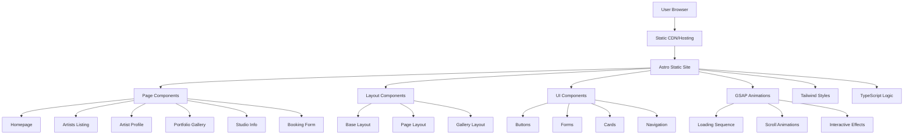
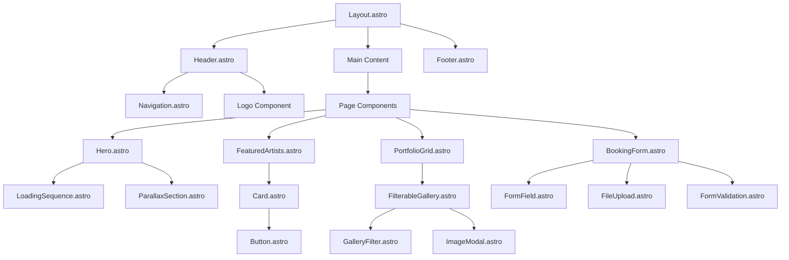

# Technical Architecture Context

## Project Overview

**Project Name:** Cuba Tattoo Studio Website  
**Location:** Albuquerque, New Mexico  
**Technology Stack:** Astro + Tailwind CSS + GSAP  
**Architecture Pattern:** Static Site Generation (SSG) with Component-Based Design  
**Performance Target:** Lighthouse Score > 90 (all metrics)  

## System Architecture

### High-Level Architecture Diagram



### Technology Stack Details

#### Core Framework: Astro 4.x
```json
{
  "framework": "Astro",
  "version": "^4.0.0",
  "rendering": "Static Site Generation (SSG)",
  "hydration": "Partial (Islands Architecture)",
  "routing": "File-based routing",
  "build_tool": "Vite"
}
```

#### Styling: Tailwind CSS 3.x
```json
{
  "framework": "Tailwind CSS",
  "version": "^3.4.0",
  "approach": "Utility-first",
  "customization": "tailwind.config.cjs",
  "purging": "Automatic unused CSS removal",
  "responsive": "Mobile-first breakpoints"
}
```

#### Animations: GSAP 3.x
```json
{
  "library": "GreenSock Animation Platform",
  "version": "^3.12.0",
  "plugins": ["ScrollTrigger", "TextPlugin"],
  "performance": "Hardware accelerated",
  "compatibility": "Cross-browser"
}
```

## File Structure Architecture

```
cubatattoostudio/
├── src/
│   ├── components/           # Reusable components
│   │   ├── ui/              # Basic UI elements
│   │   │   ├── Button.astro
│   │   │   ├── Input.astro
│   │   │   ├── Card.astro
│   │   │   ├── Modal.astro
│   │   │   └── Badge.astro
│   │   ├── layout/          # Layout components
│   │   │   ├── Header.astro
│   │   │   ├── Footer.astro
│   │   │   ├── Navigation.astro
│   │   │   └── Sidebar.astro
│   │   ├── animations/      # GSAP wrapper components
│   │   │   ├── FadeIn.astro
│   │   │   ├── SlideIn.astro
│   │   │   ├── ScrollTrigger.astro
│   │   │   ├── LoadingSequence.astro
│   │   │   └── ParallaxSection.astro
│   │   ├── forms/           # Form components
│   │   │   ├── BookingForm.astro
│   │   │   ├── ContactForm.astro
│   │   │   ├── FormField.astro
│   │   │   ├── FileUpload.astro
│   │   │   └── FormValidation.astro
│   │   ├── gallery/         # Gallery components
│   │   │   ├── PortfolioGrid.astro
│   │   │   ├── ArtistGallery.astro
│   │   │   ├── FilterableGallery.astro
│   │   │   ├── ImageModal.astro
│   │   │   └── GalleryFilter.astro
│   │   └── sections/        # Page sections
│   │       ├── Hero.astro
│   │       ├── FeaturedArtists.astro
│   │       ├── PortfolioHighlights.astro
│   │       ├── StudioInfo.astro
│   │       └── CallToAction.astro
│   ├── layouts/             # Page layouts
│   │   ├── Layout.astro     # Base layout
│   │   ├── PageLayout.astro # Standard page layout
│   │   ├── GalleryLayout.astro # Gallery-specific layout
│   │   └── FormLayout.astro # Form-specific layout
│   ├── pages/               # Route pages
│   │   ├── index.astro      # Homepage (/)
│   │   ├── artistas/        # Artists section
│   │   │   ├── index.astro  # Artists listing (/artistas)
│   │   │   └── [slug].astro # Individual artist (/artistas/[slug])
│   │   ├── portfolio.astro  # Portfolio gallery (/portfolio)
│   │   ├── estudio.astro    # Studio info (/estudio)
│   │   └── reservas.astro   # Booking form (/reservas)
│   ├── scripts/             # JavaScript/TypeScript
│   │   ├── animations/      # Animation scripts
│   │   │   ├── gsap-config.js
│   │   │   ├── loading-sequence.js
│   │   │   ├── scroll-animations.js
│   │   │   └── interactive-effects.js
│   │   ├── utils/           # Utility functions
│   │   │   ├── form-validation.ts
│   │   │   ├── image-optimization.ts
│   │   │   └── performance.ts
│   │   └── data/            # Data management
│   │       ├── artists.ts
│   │       ├── portfolio.ts
│   │       └── studio-info.ts
│   ├── styles/              # Global styles (minimal)
│   │   ├── global.css       # Global CSS reset and base
│   │   └── fonts.css        # Font loading optimization
│   ├── assets/              # Static assets
│   │   ├── images/          # Image assets
│   │   │   ├── artists/     # Artist photos
│   │   │   ├── portfolio/   # Tattoo images
│   │   │   ├── studio/      # Studio photos
│   │   │   └── ui/          # UI graphics
│   │   ├── icons/           # SVG icons
│   │   └── videos/          # Video assets
│   └── types/               # TypeScript definitions
│       ├── index.ts         # Main type definitions
│       ├── artist.ts        # Artist-related types
│       ├── portfolio.ts     # Portfolio-related types
│       └── forms.ts         # Form-related types
├── public/                  # Public static files
│   ├── favicon.ico
│   ├── robots.txt
│   ├── sitemap.xml
│   └── manifest.json
├── .trae/                   # Trae AI configuration
│   ├── agent-config.json
│   ├── prompts/
│   ├── context/
│   ├── workflows/
│   └── quality/
├── astro.config.mjs         # Astro configuration
├── tailwind.config.cjs      # Tailwind configuration
├── tsconfig.json            # TypeScript configuration
├── package.json             # Dependencies and scripts
└── README.md                # Project documentation
```

## Component Architecture

### Component Hierarchy



### Component Design Principles

#### 1. Atomic Design
- **Atoms:** Basic UI elements (Button, Input, Badge)
- **Molecules:** Simple component combinations (FormField, Card)
- **Organisms:** Complex UI sections (Header, Gallery, Form)
- **Templates:** Page layouts (Layout, PageLayout)
- **Pages:** Complete pages (index, artistas, portfolio)

#### 2. Single Responsibility
```astro
<!-- GOOD: Single responsibility -->
<!-- Button.astro - Only handles button rendering -->
<button class={buttonClasses} type={type} disabled={disabled}>
  <slot />
</button>

<!-- BAD: Multiple responsibilities -->
<!-- Don't combine button logic with form validation -->
```

#### 3. Composition over Inheritance
```astro
<!-- GOOD: Composition -->
<Card>
  <ArtistPhoto src={artist.image} alt={artist.name} />
  <ArtistInfo name={artist.name} specialties={artist.specialties} />
  <Button href={`/artistas/${artist.slug}`}>Ver Perfil</Button>
</Card>

<!-- BAD: Inheritance -->
<!-- Don't create ArtistCard that inherits from Card -->
```

## Data Architecture

### Data Models

#### Artist Model
```typescript
// src/types/artist.ts
export interface Artist {
  id: string;
  name: string;
  slug: string;
  bio: string;
  specialties: TattooStyle[];
  image: string;
  gallery: TattooImage[];
  experience_years: number;
  certifications: string[];
  social_links: {
    instagram?: string;
    facebook?: string;
    website?: string;
  };
  featured: boolean;
  available: boolean;
}
```

#### Portfolio Model
```typescript
// src/types/portfolio.ts
export interface TattooImage {
  id: string;
  url: string;
  alt: string;
  artist_id: string;
  artist_name: string;
  style: TattooStyle;
  size: TattooSize;
  body_location: string;
  date_created: string;
  featured: boolean;
  tags: string[];
}

export type TattooStyle = 
  | 'traditional'
  | 'japanese'
  | 'geometric'
  | 'blackwork'
  | 'realism'
  | 'watercolor'
  | 'minimalist'
  | 'tribal';

export type TattooSize = 'small' | 'medium' | 'large' | 'extra_large';
```

#### Booking Form Model
```typescript
// src/types/forms.ts
export interface BookingFormData {
  // Required fields
  full_name: string;
  email: string;
  phone: string;
  tattoo_description: string;
  size: TattooSize;
  body_location: string;
  
  // Optional fields
  preferred_artist?: string;
  preferred_dates?: string[];
  reference_images?: File[];
  additional_notes?: string;
  
  // System fields
  submission_date: string;
  status: 'pending' | 'reviewed' | 'scheduled' | 'completed';
}

export interface FormValidation {
  field: string;
  valid: boolean;
  message?: string;
}
```

### Data Management

#### Static Data (Build Time)
```typescript
// src/data/artists.ts
import type { Artist } from '../types/artist';

export const artists: Artist[] = [
  {
    id: 'carlos-mendez',
    name: 'Carlos Méndez',
    slug: 'carlos-mendez',
    bio: 'Especialista en tatuajes tradicionales con más de 10 años de experiencia.',
    specialties: ['traditional', 'blackwork'],
    image: '/images/artists/carlos-mendez.jpg',
    gallery: [
      // Portfolio images
    ],
    experience_years: 10,
    certifications: ['Bloodborne Pathogens', 'First Aid'],
    social_links: {
      instagram: 'https://instagram.com/carlosmendez_tattoo'
    },
    featured: true,
    available: true
  },
  // More artists...
];

// Helper functions
export function getArtistBySlug(slug: string): Artist | undefined {
  return artists.find(artist => artist.slug === slug);
}

export function getFeaturedArtists(): Artist[] {
  return artists.filter(artist => artist.featured);
}

export function getArtistsBySpecialty(specialty: TattooStyle): Artist[] {
  return artists.filter(artist => artist.specialties.includes(specialty));
}
```

## Performance Architecture

### Optimization Strategies

#### 1. Image Optimization
```astro
---
// components/ui/OptimizedImage.astro
import { Image } from 'astro:assets';

export interface Props {
  src: string;
  alt: string;
  width: number;
  height: number;
  loading?: 'lazy' | 'eager';
  class?: string;
}

const { src, alt, width, height, loading = 'lazy', class: className } = Astro.props;
---

<Image
  src={src}
  alt={alt}
  width={width}
  height={height}
  loading={loading}
  class={className}
  format="webp"
  quality={85}
  sizes="(max-width: 768px) 100vw, (max-width: 1200px) 50vw, 33vw"
/>
```

#### 2. Code Splitting
```javascript
// Dynamic imports for heavy components
const GalleryComponent = lazy(() => import('../components/gallery/PortfolioGrid.astro'));
const AnimationComponent = lazy(() => import('../scripts/animations/scroll-animations.js'));

// Conditional loading based on page
if (window.location.pathname === '/') {
  import('../scripts/animations/loading-sequence.js');
}

if (window.location.pathname.includes('/portfolio')) {
  import('../scripts/gallery/filtering.js');
}
```

#### 3. Asset Optimization
```javascript
// astro.config.mjs
export default defineConfig({
  build: {
    inlineStylesheets: 'auto',
    assets: 'assets'
  },
  vite: {
    build: {
      rollupOptions: {
        output: {
          manualChunks: {
            'vendor': ['gsap'],
            'utils': ['src/utils']
          }
        }
      }
    }
  }
});
```

### Performance Metrics

#### Target Metrics
- **First Contentful Paint (FCP):** < 1.5s
- **Largest Contentful Paint (LCP):** < 2.5s
- **First Input Delay (FID):** < 100ms
- **Cumulative Layout Shift (CLS):** < 0.1
- **Time to Interactive (TTI):** < 3.5s

#### Monitoring
```javascript
// src/scripts/utils/performance.ts
export function measurePerformance() {
  // Core Web Vitals measurement
  const observer = new PerformanceObserver((list) => {
    for (const entry of list.getEntries()) {
      if (entry.entryType === 'largest-contentful-paint') {
        console.log('LCP:', entry.startTime);
      }
      if (entry.entryType === 'first-input') {
        console.log('FID:', entry.processingStart - entry.startTime);
      }
    }
  });
  
  observer.observe({ entryTypes: ['largest-contentful-paint', 'first-input'] });
}

// Lighthouse CI integration
export function trackLighthouseMetrics() {
  // Integration with Lighthouse CI for continuous monitoring
}
```

## Security Architecture

### Security Measures

#### 1. Content Security Policy
```html
<!-- In Layout.astro -->
<meta http-equiv="Content-Security-Policy" content="
  default-src 'self';
  script-src 'self' 'unsafe-inline' https://cdnjs.cloudflare.com;
  style-src 'self' 'unsafe-inline' https://fonts.googleapis.com;
  img-src 'self' data: https:;
  font-src 'self' https://fonts.gstatic.com;
  connect-src 'self';
">
```

#### 2. Form Security
```typescript
// src/utils/form-validation.ts
export function sanitizeInput(input: string): string {
  return input
    .trim()
    .replace(/[<>"'&]/g, (match) => {
      const entities: { [key: string]: string } = {
        '<': '&lt;',
        '>': '&gt;',
        '"': '&quot;',
        "'": '&#x27;',
        '&': '&amp;'
      };
      return entities[match];
    });
}

export function validateEmail(email: string): boolean {
  const emailRegex = /^[^\s@]+@[^\s@]+\.[^\s@]+$/;
  return emailRegex.test(email);
}

export function validatePhone(phone: string): boolean {
  const phoneRegex = /^[\+]?[1-9][\d]{0,15}$/;
  return phoneRegex.test(phone.replace(/[\s\-\(\)]/g, ''));
}
```

## Accessibility Architecture

### Accessibility Features

#### 1. Semantic HTML
```astro
<!-- Proper semantic structure -->
<header role="banner">
  <nav role="navigation" aria-label="Main navigation">
    <!-- Navigation items -->
  </nav>
</header>

<main role="main">
  <section aria-labelledby="hero-heading">
    <h1 id="hero-heading">Cuba Tattoo Studio</h1>
  </section>
  
  <section aria-labelledby="artists-heading">
    <h2 id="artists-heading">Nuestros Artistas</h2>
    <!-- Artists content -->
  </section>
</main>

<footer role="contentinfo">
  <!-- Footer content -->
</footer>
```

#### 2. Keyboard Navigation
```typescript
// src/scripts/utils/accessibility.ts
export function initKeyboardNavigation() {
  // Skip links
  const skipLink = document.querySelector('.skip-link');
  skipLink?.addEventListener('click', (e) => {
    e.preventDefault();
    const target = document.querySelector('#main-content');
    target?.focus();
  });
  
  // Focus management for modals
  const modals = document.querySelectorAll('[role="dialog"]');
  modals.forEach(modal => {
    modal.addEventListener('keydown', (e) => {
      if (e.key === 'Escape') {
        closeModal(modal);
      }
    });
  });
}

// Respect user preferences
export function respectMotionPreferences() {
  const prefersReducedMotion = window.matchMedia('(prefers-reduced-motion: reduce)');
  
  if (prefersReducedMotion.matches) {
    // Disable or reduce animations
    document.documentElement.style.setProperty('--animation-duration', '0.01ms');
    
    // Disable GSAP animations
    import('../animations/gsap-config.js').then(({ gsap }) => {
      gsap.globalTimeline.timeScale(100); // Speed up to near-instant
    });
  }
}
```

---

**This technical architecture provides the foundation for building a high-performance, accessible, and maintainable website for Cuba Tattoo Studio while adhering to all specified design and development requirements.**