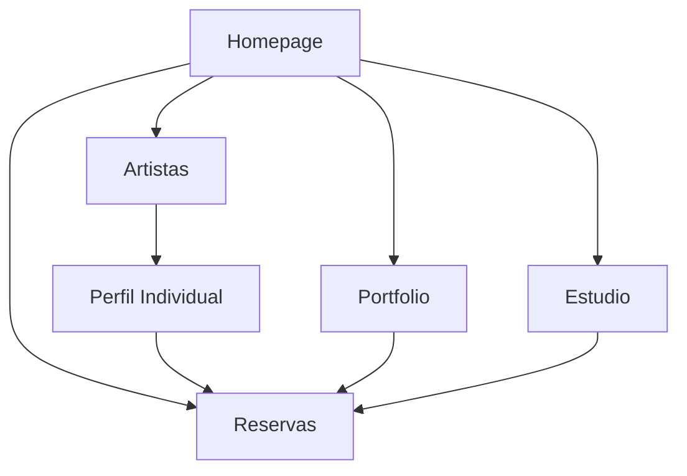

# Documento de Requerimientos del Producto - Cuba Tattoo Studio

## 1. Resumen del Proyecto

Desarrollo de un sitio web completo, moderno y de alto impacto visual para "Cuba Tattoo Studio", un estudio de tatuajes premium localizado en Albuquerque, Nuevo México. El objetivo es crear una experiencia de usuario que refleje profesionalismo y una estética audaz para atraer clientes de alto nivel que buscan arte corporal de calidad excepcional.

- **Problema a resolver:** Crear una presencia digital profesional que represente la calidad y estética del estudio de tatuajes
- **Usuarios objetivo:** Personas interesadas en tatuajes de alta calidad, que buscan artistas profesionales y un estudio con estética limpia y moderna
- **Valor del mercado:** Posicionamiento como estudio premium en el mercado de tatuajes de Albuquerque, NM

## 2. Características Principales

### 2.1 Roles de Usuario

| Rol | Método de Registro | Permisos Principales |
|-----|-------------------|---------------------|
| Visitante | No requiere registro | Puede navegar por todo el sitio, ver portfolio, información del estudio |
| Cliente Potencial | Formulario de contacto | Puede solicitar citas, subir referencias, contactar artistas específicos |

### 2.2 Módulo de Funcionalidades

Nuestros requerimientos del sitio web consisten en las siguientes páginas principales:

1. **Homepage**: Hero animado con secuencia de carga, presentación del estudio, CTAs principales hacia artistas y reservas
2. **Página de Artistas**: Grid responsivo con todos los artistas del estudio, información básica y enlaces a perfiles individuales
3. **Perfiles de Artistas**: Biografía detallada, galería extensa de trabajos, especialidades, enlace directo a reservas
4. **Portfolio**: Galería maestra filtrable por artista y estilo de tatuaje, lazy loading de imágenes
5. **Estudio**: Información "Sobre Nosotros" combinada con FAQ, historia, procesos, normas de higiene
6. **Reservas**: Formulario detallado de contacto, información de ubicación, mapa, horarios

### 2.3 Detalles de Páginas

| Nombre de Página | Nombre del Módulo | Descripción de Funcionalidad |
|------------------|-------------------|------------------------------|
| Homepage | Hero Animado | Secuencia de carga con logo, zoom-out de imagen de fondo, aparición escalonada de elementos UI |
| Homepage | Secciones de Contenido | Revelado escalonado con scroll, efectos parallax, pinning de sección hero |
| Homepage | Navegación Principal | CTAs claros hacia artistas y reservas, menú de navegación responsive |
| Artistas | Grid de Artistas | Cuadrícula responsive con fotos, nombres, especialidades, hover effects sutiles |
| Artistas | Tarjetas de Artista | Información básica: foto, nombre, especialidades principales |
| Perfil de Artista | Biografía | Historia personal, experiencia, filosofía artística |
| Perfil de Artista | Galería Personal | Colección extensa de trabajos del artista, alta calidad |
| Perfil de Artista | CTA Reservas | Enlace directo a formulario con artista preseleccionado (David, Nina o Karli) |
| Portfolio | Galería Maestra | Todos los trabajos del estudio en formato grid |
| Portfolio | Filtros | Filtrado por artista y estilo (Tradicional, Japonés, Geométrico, Blackwork, Realismo, etc.) |
| Portfolio | Optimización | Lazy loading, múltiples tamaños de imagen, compresión optimizada |
| Estudio | Sobre Nosotros | Historia del estudio, filosofía, valores, equipo |
| Estudio | FAQ | Preguntas frecuentes sobre precios, proceso, cuidados, políticas |
| Estudio | Información de Seguridad | Normas de higiene, certificaciones, procesos de esterilización |
| Reservas | Formulario de Contacto | Campos: nombre, email, teléfono, descripción, tamaño, ubicación, artista preferido |
| Reservas | Upload de Referencias | Funcionalidad para subir imágenes de referencia |
| Reservas | Información de Contacto | Dirección, teléfono, horarios, mapa integrado |

## 3. Proceso Principal

**Flujo Principal del Usuario:**

1. **Descubrimiento:** El usuario llega a la homepage y experimenta la secuencia de animación de carga
2. **Exploración:** Navega por las secciones con scroll, descubriendo información del estudio
3. **Investigación:** Visita la página de artistas para conocer el equipo y sus especialidades
4. **Evaluación:** Revisa el portfolio filtrable para ver trabajos por estilo o artista específico
5. **Información:** Consulta la página del estudio para FAQ y procesos
6. **Conversión:** Completa el formulario de reservas con sus requerimientos específicos

## 4. Diseño de Interfaz de Usuario

### 4.1 Estilo de Diseño

**Paleta de Colores:**
- **Principal:** Negro absoluto (#000000)
- **Secundario:** Blanco puro (#FFFFFF)
- **Acentos:** Escala de grises (#A0A0A0, #525252)
- **Estados de Error:** Rojo sutil solo para validación de formularios

**Estilo de Botones:** Minimalistas con bordes limpios, efectos hover sutiles

**Tipografía:**
- **Encabezados:** Bebas Neue (condensada, mayúsculas, impactante)
- **Cuerpo:** Inter (legible, sans-serif)
- **Tamaños:** h1: 3rem, h2: 2rem, body: 1rem

**Estilo de Layout:** Minimalista, espacios amplios, navegación superior fija

**Iconografía:** Iconos lineales simples, estilo minimalista coherente con la estética B&N

### 4.2 Resumen de Diseño de Páginas

| Nombre de Página | Nombre del Módulo | Elementos de UI |
|------------------|-------------------|----------------|
| Homepage | Hero Section | Fondo negro, logo "CUBA" en Bebas Neue, animación de zoom-out, elementos UI con stagger fade-in |
| Homepage | Secciones de Contenido | Fondos con parallax, texto blanco sobre negro, transiciones suaves, scroll pinning |
| Artistas | Grid de Artistas | Cards con hover effects, imágenes en escala de grises, tipografía Bebas Neue para nombres |
| Portfolio | Galería | Grid masonry, filtros dropdown estilo minimalista, lazy loading con placeholders |
| Estudio | Contenido | Layout de dos columnas, tipografía Inter para legibilidad, secciones bien definidas |
| Reservas | Formulario | Campos con bordes sutiles, validación en tiempo real, botón CTA prominente |

### 4.3 Responsividad

Diseño mobile-first con breakpoints optimizados:
- **Mobile:** < 640px - Stack vertical, navegación hamburger
- **Tablet:** 640px - 1024px - Grid de 2 columnas, navegación horizontal
- **Desktop:** > 1024px - Grid completo, todas las funcionalidades visibles

Optimización táctil para dispositivos móviles con áreas de toque de mínimo 44px.