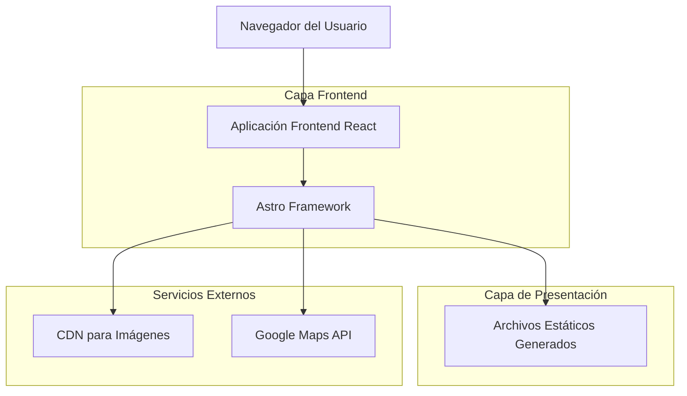
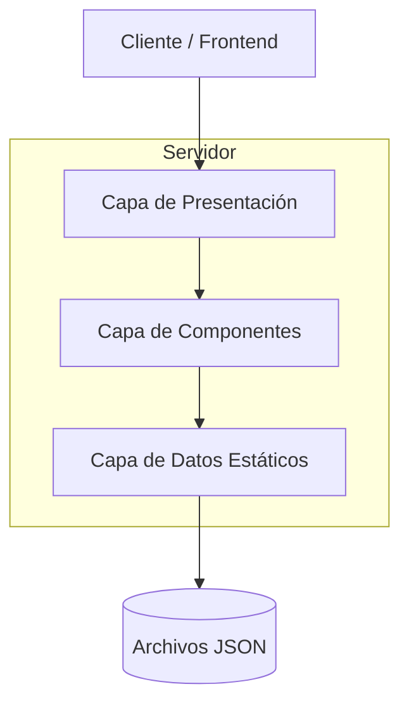

# Documento de Arquitectura Técnica - Cuba Tattoo Studio

## 1. Diseño de Arquitectura



## 2. Descripción de Tecnologías

* **Frontend:** Astro\@5.9.2 + Tailwind CSS\@4.1.9 + GSAP\@3.13.0

* **Backend:** Ninguno (sitio estático)

* **Servicios:** Google Maps API para ubicación del estudio

## 3. Definiciones de Rutas

| Ruta              | Propósito                                                   |
| ----------------- | ----------------------------------------------------------- |
| /                 | Homepage con hero animado y presentación del estudio        |
| /artistas         | Página grid con todos los artistas del estudio              |
| /artistas/\[slug] | Perfil individual de cada artista (david, nina, karli) con biografía y galería   |
| /portfolio        | Galería maestra filtrable por artista y estilo de tatuaje   |
| /estudio          | Página combinada de "Sobre Nosotros" y FAQ                  |
| /reservas         | Formulario de contacto, información de ubicación y horarios |

## 4. Definiciones de API

### 4.1 API Principal

**Formulario de contacto**

```
POST /api/contact
```

Request:

| Nombre del Parámetro | Tipo de Parámetro | Es Requerido | Descripción                        |
| -------------------- | ----------------- | ------------ | ---------------------------------- |
| name                 | string            | true         | Nombre completo del cliente        |
| email                | string            | true         | Email de contacto                  |
| phone                | string            | true         | Número de teléfono                 |
| description          | string            | true         | Descripción de la idea del tatuaje |
| size                 | string            | true         | Tamaño aproximado del tatuaje      |
| location             | string            | true         | Ubicación en el cuerpo             |
| artist               | string            | false        | Artista de preferencia             |
| references           | file\[]           | false        | Imágenes de referencia             |

Response:

| Nombre del Parámetro | Tipo de Parámetro | Descripción                     |
| -------------------- | ----------------- | ------------------------------- |
| success              | boolean           | Estado de la respuesta          |
| message              | string            | Mensaje de confirmación o error |

Ejemplo:

```json
{
  "name": "Juan Pérez",
  "email": "juan@email.com",
  "phone": "+1-505-123-4567",
  "description": "Tatuaje de dragón japonés en el brazo",
  "size": "Mediano (10-15cm)",
  "location": "Brazo derecho",
  "artist": "david"
}
```

## 5. Diagrama de Arquitectura del Servidor



## 6. Modelo de Datos

### 6.1 Definición del Modelo de Datos

```mermaid
erDiagram
    ARTIST ||--o{ PORTFOLIO_ITEM : creates
    STYLE ||--o{ PORTFOLIO_ITEM : categorizes
    CONTACT_FORM ||--o{ ARTIST : prefers
    
    ARTIST {
        string id PK
        string name
        string slug
        string bio
        string image
        string[] specialties
        boolean active
    }
    
    PORTFOLIO_ITEM {
        string id PK
        string title
        string description
        string image
        string artist_id FK
        string style_id FK
        date created_at
    }
    
    STYLE {
        string id PK
        string name
        string description
        string slug
    }
    
    CONTACT_FORM {
        string id PK
        string name
        string email
        string phone
        string description
        string size
        string location
        string artist_id FK
        date submitted_at
    }
```

### 6.2 Lenguaje de Definición de Datos

**Estructura de Artistas (artists.json)**

```json
{
  "artists": [
    {
      "id": "david",
      "name": "David",
      "slug": "david",
      "bio": "Especialista en tatuajes japoneses con más de 10 años de experiencia. Formado en técnicas tradicionales de Irezumi.",
      "image": "/images/artists/david.webp",
      "specialties": ["Japonés", "Blackwork", "Tradicional"],
      "active": true,
      "portfolio": [
        {
          "id": "dragon-sleeve",
          "title": "Manga de Dragón Japonés",
          "description": "Tatuaje tradicional japonés de dragón en manga completa",
          "image": "/images/portfolio/david-dragon-sleeve.webp",
          "style": "japones",
          "created_at": "2024-01-15"
        }
      ]
    },
    {
      "id": "nina",
      "name": "Nina",
      "slug": "nina",
      "bio": "Artista especializada en realismo y blackwork, con un enfoque único en retratos y diseños geométricos.",
      "image": "/images/artists/nina.webp",
      "specialties": ["Realismo", "Blackwork", "Geométrico"],
      "active": true,
      "portfolio": [
        {
          "id": "geometric-mandala",
          "title": "Mandala Geométrico",
          "description": "Diseño geométrico complejo con patrones simétricos",
          "image": "/images/portfolio/nina-geometric-mandala.webp",
          "style": "geometrico",
          "created_at": "2024-02-10"
        }
      ]
    },
    {
      "id": "karli",
      "name": "Karli",
      "slug": "karli",
      "bio": "Especialista en tatuajes minimalistas y tradicionales americanos, conocida por su precisión en líneas finas.",
      "image": "/images/artists/karli.webp",
      "specialties": ["Minimalista", "Tradicional", "Línea Fina"],
      "active": true,
      "portfolio": [
        {
          "id": "minimalist-rose",
          "title": "Rosa Minimalista",
          "description": "Diseño minimalista de rosa con líneas limpias",
          "image": "/images/portfolio/karli-minimalist-rose.webp",
          "style": "minimalista",
          "created_at": "2024-01-28"
        }
      ]
    }
  ]
}
```

**Estructura de Estilos (styles.json)**

```json
{
  "styles": [
    {
      "id": "tradicional",
      "name": "Tradicional Americano",
      "slug": "tradicional",
      "description": "Estilo clásico con líneas gruesas y colores sólidos"
    },
    {
      "id": "japones",
      "name": "Japonés (Irezumi)",
      "slug": "japones",
      "description": "Arte tradicional japonés con motivos culturales"
    },
    {
      "id": "blackwork",
      "name": "Blackwork",
      "slug": "blackwork",
      "description": "Tatuajes en tinta negra sólida con patrones geométricos"
    },
    {
      "id": "realismo",
      "name": "Realismo",
      "slug": "realismo",
      "description": "Representaciones fotorrealistas y detalladas"
    },
    {
      "id": "geometrico",
      "name": "Geométrico",
      "slug": "geometrico",
      "description": "Diseños basados en formas y patrones geométricos"
    },
    {
      "id": "minimalista",
      "name": "Minimalista",
      "slug": "minimalista",
      "description": "Diseños simples y limpios con líneas finas"
    }
  ]
}
```

**Configuración del Estudio (studio.json)**

```json
{
  "studio": {
    "name": "Cuba Tattoo Studio",
    "description": "Estudio de tatuajes premium en Albuquerque, Nuevo México",
    "address": {
      "street": "123 Central Ave NW",
      "city": "Albuquerque",
      "state": "NM",
      "zipCode": "87102",
      "country": "USA"
    },
    "contact": {
      "phone": "+1-505-123-4567",
      "email": "info@cubatattoostudio.com"
    },
    "hours": {
      "monday": "10:00 - 20:00",
      "tuesday": "10:00 - 20:00",
      "wednesday": "10:00 - 20:00",
      "thursday": "10:00 - 20:00",
      "friday": "10:00 - 20:00",
      "saturday": "10:00 - 20:00",
      "sunday": "Cerrado"
    },
    "social": {
      "instagram": "@cubatattoostudio",
      "facebook": "CubaTattooStudioABQ"
    }
  }
}
```

**Configuración de Astro (astro.config.mjs)**

```javascript
import { defineConfig } from 'astro/config';
import tailwind from '@astrojs/tailwind';

export default defineConfig({
  site: 'https://cubatattoostudio.com',
  integrations: [
    tailwind()
  ],
  vite: {
    plugins: [tailwind()],
    ssr: {
      external: ['gsap']
    }
  },
  build: {
    assets: 'assets'
  }
});
```

**Configuración de Tailwind (tailwind.config.cjs)**

```javascript
module.exports = {
  content: ['./src/**/*.{astro,html,js,jsx,md,mdx,svelte,ts,tsx,vue}'],
  theme: {
    extend: {
      colors: {
        'cuba-black': '#000000',
        'cuba-white': '#FFFFFF',
        'cuba-gray': {
          400: '#A0A0A0',
          600: '#525252'
        }
      },
      fontFamily: {
        'heading': ['Bebas Neue', 'Arial Black', 'sans-serif'],
        'body': ['Inter', 'system-ui', 'sans-serif']
      },
      animation: {
        'fade-in': 'fadeIn 0.6s ease-out',
        'slide-up': 'slideUp 0.8s ease-out',
        'stagger': 'stagger 0.4s ease-out',
        'bounce-pulse': 'bounce-pulse 2s ease-in-out infinite'
      },
      keyframes: {
        fadeIn: {
          '0%': { opacity: '0' },
          '100%': { opacity: '1' }
        },
        slideUp: {
          '0%': { transform: 'translateY(20px)', opacity: '0' },
          '100%': { transform: 'translateY(0)', opacity: '1' }
        },
        stagger: {
          '0%': { transform: 'translateY(10px)', opacity: '0' },
          '100%': { transform: 'translateY(0)', opacity: '1' }
        }
      }
    
```

