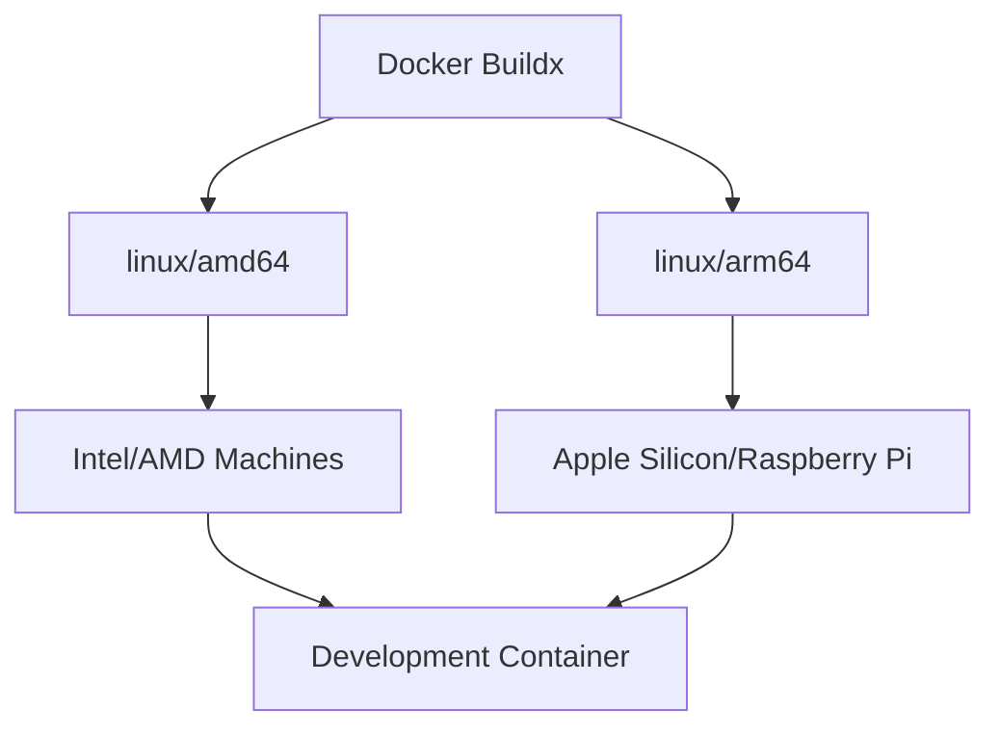

# Entorno de Desarrollo Reproducible - Cuba Tattoo Studio

## 1. Análisis de Opciones: DevContainer vs Makefile/Dotfiles

### 1.1 Comparación Técnica

| Aspecto | DevContainer | Makefile/Dotfiles |
|---------|--------------|-------------------|
| **Consistencia** | ✅ Entorno idéntico en todos los SO | ⚠️ Depende del SO anfitrión |
| **Aislamiento** | ✅ Contenedor completamente aislado | ❌ Modifica el sistema anfitrión |
| **Portabilidad** | ✅ Funciona en cualquier máquina con Docker | ⚠️ Requiere adaptaciones por SO |
| **Performance** | ⚠️ Overhead de contenedor | ✅ Performance nativa |
| **Complejidad Setup** | ✅ Un solo comando | ⚠️ Múltiples pasos manuales |
| **Soporte IDE** | ✅ Integración nativa VS Code | ⚠️ Configuración manual |
| **Multiplataforma** | ✅ ARM/AMD automático | ❌ Scripts específicos por arquitectura |

### 1.2 Decisión Recomendada: DevContainer

**Razones principales:**
- **Garantía de consistencia:** Mismo entorno en desarrollo, CI/CD y producción
- **Soporte multiplataforma:** Docker maneja automáticamente ARM/AMD
- **Integración VS Code:** Experiencia de desarrollo seamless
- **Aislamiento completo:** No contamina el sistema anfitrión
- **Reproducibilidad:** Cualquier desarrollador puede contribuir inmediatamente

## 2. Arquitectura Docker Multiplataforma

### 2.1 Estrategia Multi-Architecture



### 2.2 Base Image Selection

**Imagen base:** `node:20-alpine`
- **Ventajas:** Ligera, segura, soporte ARM/AMD nativo
- **Tamaño:** ~40MB vs ~200MB de ubuntu
- **Compatibilidad:** Node.js 20 LTS para Astro

## 3. Configuración DevContainer

### 3.1 Estructura de Archivos

```
.devcontainer/
├── devcontainer.json     # Configuración VS Code
├── Dockerfile           # Imagen de desarrollo
├── docker-compose.yml   # Servicios adicionales
└── scripts/
    ├── postCreateCommand.sh
    └── setup-tools.sh
```

### 3.2 Herramientas Incluidas

- **Runtime:** Node.js 20 LTS, npm, pnpm
- **CLI Tools:** git, curl, wget, unzip
- **Development:** tmux, neovim, fzf, ripgrep
- **Cloudflare:** wrangler CLI
- **Shell:** zsh + oh-my-zsh + starship

## 4. Configuración tmux (Estilo ThePrimeagen)

### 4.1 Características Principales

- **Prefix Key:** `Ctrl-a` (más ergonómico que Ctrl-b)
- **Plugin Manager:** TPM (Tmux Plugin Manager)
- **Navegación:** Vim-style keybindings
- **Sesiones:** Auto-restore con tmux-resurrect
- **Tema:** Minimalista, compatible con Neovim

### 4.2 Plugins Esenciales

```bash
# ~/.tmux.conf
set -g @plugin 'tmux-plugins/tpm'
set -g @plugin 'tmux-plugins/tmux-sensible'
set -g @plugin 'tmux-plugins/tmux-resurrect'
set -g @plugin 'tmux-plugins/tmux-continuum'
set -g @plugin 'tmux-plugins/tmux-yank'
set -g @plugin 'christoomey/vim-tmux-navigator'
```

### 4.3 Configuración de Ventanas y Paneles

- **Split horizontal:** `Prefix + |`
- **Split vertical:** `Prefix + -`
- **Navegación:** `Prefix + hjkl`
- **Resize:** `Prefix + HJKL`

## 5. Configuración Neovim (Estilo ThePrimeagen)

### 5.1 Plugin Manager: lazy.nvim

```lua
-- ~/.config/nvim/init.lua
require("config.lazy")
require("config.options")
require("config.keymaps")
```

### 5.2 Plugins Esenciales

| Plugin | Propósito | Configuración |
|--------|-----------|---------------|
| **telescope.nvim** | Fuzzy finder | `<leader>ff`, `<leader>fg` |
| **nvim-treesitter** | Syntax highlighting | Astro, JS, TS, CSS |
| **lualine.nvim** | Status line | Tema minimalista |
| **gitsigns.nvim** | Git integration | Hunks, blame, diff |
| **nvim-lspconfig** | LSP client | Astro, TypeScript, Tailwind |
| **nvim-cmp** | Autocompletion | Snippet + LSP sources |
| **harpoon** | File navigation | Quick file switching |

### 5.3 LSP Configuration

```lua
-- Servidores LSP para el proyecto
local servers = {
  'astro',           -- Astro framework
  'tsserver',        -- TypeScript/JavaScript
  'tailwindcss',     -- Tailwind CSS
  'html',            -- HTML
  'cssls',           -- CSS
}
```

### 5.4 Tema y Colores

- **Colorscheme:** `tokyonight` o `gruvbox`
- **Transparencia:** Habilitada para tmux integration
- **Cursor:** Block en normal, line en insert

## 6. Scripts de Bootstrapping

### 6.1 Makefile Principal

```makefile
.PHONY: init dev build deploy clean

# Inicialización completa del entorno
init:
	@echo "🚀 Inicializando entorno de desarrollo..."
	./scripts/install-dependencies.sh
	./scripts/setup-dotfiles.sh
	./scripts/setup-devcontainer.sh

# Desarrollo local
dev:
	docker-compose up -d
	npm run dev

# Build para producción
build:
	npm run build

# Deploy a Cloudflare Pages
deploy:
	npx wrangler pages deploy dist

# Limpieza
clean:
	docker-compose down -v
	docker system prune -f
```

### 6.2 Script de Instalación de Dependencias

```bash
#!/bin/bash
# scripts/install-dependencies.sh

set -e

echo "🔍 Detectando sistema operativo..."

if [[ "$OSTYPE" == "darwin"* ]]; then
    # macOS
    if ! command -v brew &> /dev/null; then
        echo "📦 Instalando Homebrew..."
        /bin/bash -c "$(curl -fsSL https://raw.githubusercontent.com/Homebrew/install/HEAD/install.sh)"
    fi
    
    brew install docker docker-compose
    
elif [[ "$OSTYPE" == "linux-gnu"* ]]; then
    # Linux (Ubuntu/Debian)
    sudo apt update
    sudo apt install -y docker.io docker-compose
    sudo usermod -aG docker $USER
    
else
    echo "❌ Sistema operativo no soportado"
    exit 1
fi

echo "✅ Dependencias instaladas correctamente"
```

### 6.3 Setup de Dotfiles

```bash
#!/bin/bash
# scripts/setup-dotfiles.sh

DOTFILES_DIR="$HOME/.dotfiles"
CONFIG_DIR="$HOME/.config"

# Crear directorios necesarios
mkdir -p $CONFIG_DIR/{nvim,tmux}

# Symlinks para dotfiles
ln -sf $DOTFILES_DIR/tmux.conf $HOME/.tmux.conf
ln -sf $DOTFILES_DIR/zshrc $HOME/.zshrc
ln -sf $DOTFILES_DIR/nvim $CONFIG_DIR/nvim
ln -sf $DOTFILES_DIR/starship.toml $CONFIG_DIR/starship.toml

echo "✅ Dotfiles configurados"
```

## 7. Flujo de Desarrollo y Despliegue

### 7.1 Comandos de Desarrollo

```bash
# Iniciar entorno de desarrollo
make dev
# o
docker-compose up -d && npm run dev

# Desarrollo con hot reload
npm run dev          # http://localhost:4321

# Preview de producción
npm run build
npm run preview      # http://localhost:4321
```

### 7.2 Despliegue a Cloudflare Pages

#### Configuración Inicial

```bash
# Instalar Wrangler CLI
npm install -g wrangler

# Autenticación
wrangler login

# Configurar proyecto
wrangler pages project create cubatattoostudio
```

#### Despliegue Automático

```bash
# Build y deploy en un comando
make deploy

# O manualmente
npm run build
npx wrangler pages deploy dist --project-name=cubatattoostudio
```

### 7.3 CI/CD con GitHub Actions

```yaml
# .github/workflows/deploy.yml
name: Deploy to Cloudflare Pages

on:
  push:
    branches: [main]
  pull_request:
    branches: [main]

jobs:
  deploy:
    runs-on: ubuntu-latest
    steps:
      - uses: actions/checkout@v4
      
      - name: Setup Node.js
        uses: actions/setup-node@v4
        with:
          node-version: '20'
          cache: 'npm'
      
      - name: Install dependencies
        run: npm ci
      
      - name: Build
        run: npm run build
      
      - name: Deploy to Cloudflare Pages
        uses: cloudflare/pages-action@v1
        with:
          apiToken: ${{ secrets.CLOUDFLARE_API_TOKEN }}
          accountId: ${{ secrets.CLOUDFLARE_ACCOUNT_ID }}
          projectName: cubatattoostudio
          directory: dist
```

## 8. Configuración de Performance

### 8.1 Optimizaciones Docker

- **Multi-stage builds:** Imagen de desarrollo vs producción
- **Layer caching:** Optimización de capas Docker
- **Volume mounts:** Código fuente como volumen para hot reload

### 8.2 Configuración de Red

```yaml
# docker-compose.yml
version: '3.8'
services:
  dev:
    build: .
    ports:
      - "4321:4321"    # Astro dev server
      - "3000:3000"    # Preview server
    volumes:
      - .:/workspace
      - node_modules:/workspace/node_modules
    environment:
      - NODE_ENV=development
```

## 9. Troubleshooting y Mantenimiento

### 9.1 Problemas Comunes

| Problema | Solución |
|----------|----------|
| **Puerto ocupado** | `lsof -ti:4321 \| xargs kill -9` |
| **Permisos Docker** | `sudo usermod -aG docker $USER` |
| **Cache npm corrupto** | `npm cache clean --force` |
| **Contenedor no inicia** | `docker-compose down && docker-compose up --build` |

### 9.2 Comandos de Mantenimiento

```bash
# Limpiar contenedores
docker system prune -a

# Actualizar dependencias
npm update

# Rebuild completo
make clean && make init
```

## 10. Estructura Final del Proyecto

```
cubatattoostudio/
├── .devcontainer/
│   ├── devcontainer.json
│   ├── Dockerfile
│   └── docker-compose.yml
├── .dotfiles/
│   ├── tmux.conf
│   ├── zshrc
│   ├── starship.toml
│   └── nvim/
├── scripts/
│   ├── install-dependencies.sh
│   ├── setup-dotfiles.sh
│   └── setup-devcontainer.sh
├── Makefile
├── wrangler.toml
└── [resto del proyecto Astro]
```

## Conclusión

Esta configuración proporciona:

✅ **Entorno reproducible** en cualquier máquina
✅ **Soporte multiplataforma** ARM/AMD automático
✅ **Herramientas de desarrollo** modernas y optimizadas
✅ **Flujo de despliegue** automatizado a Cloudflare Pages
✅ **Configuración profesional** tmux + Neovim estilo ThePrimeagen

El desarrollador solo necesita:
1. Clonar el repositorio
2. Ejecutar `make init`
3. Abrir VS Code con la extensión Dev Containers
4. Comenzar a desarrollar

Todo el entorno se configura automáticamente, garantizando consistencia y productividad desde el primer día.