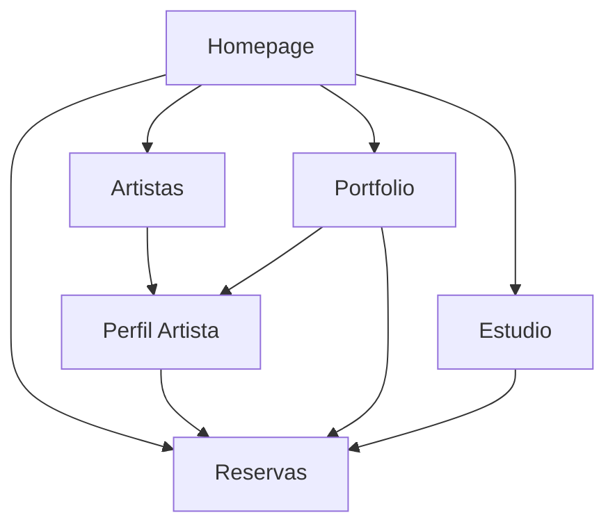

# Documento de Requisitos del Producto - Cuba Tattoo Studio

## 1. Product Overview

Cuba Tattoo Studio es un sitio web premium para un estudio de tatuajes ubicado en Albuquerque, Nuevo México, que ofrece servicios de tatuaje de alta calidad con una estética moderna y minimalista.

El proyecto resuelve la necesidad de presencia digital profesional para atraer clientes que buscan arte corporal de calidad, facilitando la reserva de citas y showcasing del portfolio de artistas especializados.

Objetivo: Posicionar a Cuba Tattoo Studio como el estudio de tatuajes premium líder en Albuquerque, aumentando las reservas en un 40% en el primer año.

## 2. Core Features

### 2.1 User Roles

| Role | Registration Method | Core Permissions |
|------|---------------------|------------------|
| Visitante | Acceso directo | Puede navegar, ver portfolio, contactar |
| Cliente Potencial | Formulario de reserva | Puede solicitar citas, subir referencias |

### 2.2 Feature Module

Nuestro sitio web de Cuba Tattoo Studio consiste en las siguientes páginas principales:

1. **Homepage**: hero animado con efectos GSAP, navegación principal, CTAs de reserva, artistas destacados.
2. **Artistas**: grid responsivo de artistas, filtros por especialidad, enlaces a perfiles individuales.
3. **Perfil de Artista**: biografía detallada, galería extensa de trabajos, especialidades, formulario de contacto directo.
4. **Portfolio**: galería maestra filtrable por artista y estilo, lazy loading, lightbox para imágenes.
5. **Estudio**: información sobre nosotros, FAQ, proceso de tatuaje, normas de higiene y seguridad.
6. **Reservas**: formulario detallado de solicitud de cita, mapa del estudio, información de contacto.

### 2.3 Page Details

| Page Name | Module Name | Feature description |
|-----------|-------------|---------------------|
| Homepage | Hero Section | Animación de carga con logo, video/imagen de fondo con zoom-out, elementos UI con stagger fade-in |
| Homepage | Scroll Animations | ScrollTrigger con pinning, revelado escalonado, efectos parallax sincronizados |
| Homepage | Featured Artists | Grid de artistas destacados con hover effects, enlaces directos a perfiles |
| Artistas | Artist Grid | Grid responsivo con filtros por especialidad, información básica (foto, nombre, especialidades) |
| Artistas | Navigation | Transiciones suaves a páginas individuales, breadcrumbs |
| Perfil Artista | Biography Section | Información detallada del artista, años de experiencia, filosofía |
| Perfil Artista | Portfolio Gallery | Galería extensa con lightbox, categorización por estilo, lazy loading |
| Perfil Artista | Contact Integration | Formulario preseleccionado con el artista, enlaces a redes sociales |
| Portfolio | Filter System | Filtros combinables por artista y estilo de tatuaje, búsqueda en tiempo real |
| Portfolio | Image Gallery | Grid masonry responsivo, lazy loading, lightbox con información detallada |
| Estudio | About Section | Historia del estudio, filosofía, equipo, certificaciones |
| Estudio | FAQ Module | Preguntas frecuentes sobre precios, proceso, cuidados, políticas |
| Estudio | Process Guide | Paso a paso del proceso de tatuaje, desde consulta hasta cuidado posterior |
| Reservas | Booking Form | Formulario completo con validación (nombre, email, teléfono, descripción, tamaño, ubicación, artista preferido, upload de referencias) |
| Reservas | Location Info | Mapa interactivo, dirección, horarios, información de contacto |
| Reservas | Contact Methods | Múltiples formas de contacto, redes sociales, teléfono directo |

## 3. Core Process

**Flujo Principal del Usuario:**

1. El usuario llega a la homepage y experimenta las animaciones de carga
2. Navega por los artistas destacados o accede directamente al portfolio
3. Filtra trabajos por estilo o artista de interés
4. Revisa el perfil detallado del artista seleccionado
5. Accede a la página de reservas con el artista preseleccionado
6. Completa el formulario de solicitud de cita con todos los detalles
7. Recibe confirmación y es contactado por el estudio

**Flujo de Navegación:**

## 4. User Interface Design

### 4.1 Design Style

- **Colores Primarios**: Negro absoluto (#000000) como fondo principal, Blanco puro (#FFFFFF) para texto principal
- **Colores Secundarios**: Escala de grises (#A0A0A0, #525252) para texto secundario y detalles
- **Estilo de Botones**: Minimalistas con bordes limpios, efectos hover sutiles, transiciones suaves
- **Tipografía**: Bebas Neue para encabezados (condensada, mayúsculas), Inter para cuerpo de texto (legible, sans-serif)
- **Layout**: Diseño limpio tipo card-based, navegación superior fija, espaciado generoso
- **Iconografía**: Iconos minimalistas en línea, emojis sutiles para acentuar contenido

### 4.2 Page Design Overview

| Page Name | Module Name | UI Elements |
|-----------|-------------|-------------|
| Homepage | Hero Section | Video/imagen fullscreen, logo animado, navegación transparente, efectos de partículas sutiles |
| Homepage | Scroll Sections | Secciones con pinning, texto superpuesto, transiciones fade-in, parallax backgrounds |
| Artistas | Artist Cards | Cards con hover effects, imágenes circulares, badges de especialidades, transiciones suaves |
| Portfolio | Filter Bar | Dropdown filters estilizados, botones toggle, contador de resultados |
| Portfolio | Image Grid | Grid masonry responsivo, overlay con información, lightbox modal |
| Reservas | Form Design | Inputs minimalistas, labels flotantes, validación visual, botón CTA prominente |

### 4.3 Responsividad

El producto es mobile-first con adaptación completa a desktop. Incluye optimización para touch interaction en dispositivos móviles, con navegación por gestos y elementos táctiles apropiados. Breakpoints: 640px (sm), 768px (md), 1024px (lg), 1280px (xl).