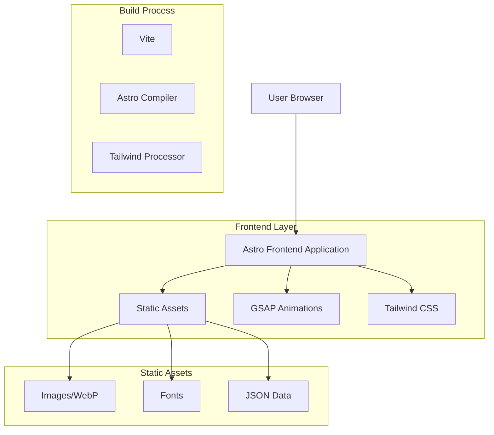

# Documento de Arquitectura Técnica - Cuba Tattoo Studio

## 1. Architecture design



## 2. Technology Description

- **Frontend**: Astro@5.9.2 + Tailwind CSS@4.1.9 + GSAP@3.13.0 + Vite
- **Backend**: None (Static Site Generation)
- **Deployment**: GitHub Pages (docs.cubatattoostudio.com)

## 3. Route definitions

| Route | Purpose |
|-------|----------|
| / | Homepage con animaciones hero y scroll effects |
| /artistas | Grid de todos los artistas del estudio |
| /artistas/[slug] | Perfil individual de artista con portfolio |
| /portfolio | Galería maestra filtrable por artista y estilo |
| /estudio | Información del estudio y FAQ |
| /reservas | Formulario de contacto y reservas |

## 4. Data model

### 4.1 Data model definition

```mermaid
erDiagram
    ARTIST ||--o{ PORTFOLIO_ITEM : creates
    ARTIST ||--o{ SPECIALTY : has
    PORTFOLIO_ITEM ||--|| STYLE : belongs_to
    STYLE ||--o{ PORTFOLIO_ITEM : contains
    
    ARTIST {
        string id PK
        string name
        string slug
        string bio
        string experience
        string image
        boolean featured
        object contact
    }
    
    PORTFOLIO_ITEM {
        string id PK
        string artist_id FK
        string image
        string title
        string style
        string description
        string size
        string bodyPart
    }
    
    STYLE {
        string id PK
        string name
        string slug
        string description
        array characteristics
        array artists
        boolean featured
    }
    
    SPECIALTY {
        string name
        string artist_id FK
    }
```

### 4.2 Data Definition Language

**Artists Data Structure (artists.json)**
```json
{
  "artists": [
    {
      "id": "artist-slug",
      "name": "Artist Name",
      "slug": "artist-slug",
      "specialties": ["Style1", "Style2"],
      "bio": "Artist biography...",
      "experience": "X+ años",
      "image": "/images/artists/artist.jpg",
      "featured": true,
      "portfolio": [
        {
          "id": "work-id",
          "image": "/images/portfolio/work.jpg",
          "title": "Work Title",
          "style": "Style Name",
          "description": "Work description",
          "size": "small|medium|large",
          "bodyPart": "arm|back|chest|etc"
        }
      ],
      "contact": {
        "instagram": "@handle",
        "email": "artist@cubatattoostudio.com"
      }
    }
  ]
}
```

**Tattoo Styles Data Structure (tattoo-styles.json)**
```json
{
  "styles": [
    {
      "id": "style-slug",
      "name": "Style Name",
      "slug": "style-slug",
      "description": "Style description...",
      "characteristics": ["Characteristic1", "Characteristic2"],
      "artists": ["artist1", "artist2"],
      "featured": true
    }
  ],
  "categories": {
    "by_complexity": {
      "simple": ["minimalista", "fine-line"],
      "medium": ["tradicional", "geometrico"],
      "complex": ["japones", "realismo", "blackwork"]
    },
    "by_color": {
      "black_only": ["blackwork", "minimalista"],
      "color": ["tradicional", "japones"],
      "mixed": ["geometrico", "biomecanico"]
    }
  }
}
```

## 5. Component Architecture

### 5.1 Component Structure

```
src/components/
├── animations/          # GSAP animation wrappers
│   ├── FadeInSection.astro
│   ├── GSAPWrapper.astro
│   ├── ParallaxContainer.astro
│   ├── SlideInImage.astro
│   └── StaggerText.astro
├── effects/             # Visual effects
│   └── ParticleSystem.astro
├── forms/               # Form components
│   └── BookingForm.astro
├── gallery/             # Portfolio components
│   ├── PortfolioFilters.astro
│   └── PortfolioGrid.astro
├── layout/              # Layout components
│   ├── Footer.astro
│   └── Header.astro
└── ui/                  # Basic UI components
    ├── Badge.astro
    ├── Button.astro
    ├── Card.astro
    ├── Input.astro
    ├── MicroInteractions.astro
    └── VisualEffects.astro
```

### 5.2 Animation System

**GSAP Integration Pattern:**
```javascript
// GSAPWrapper.astro - Base animation wrapper
import { gsap } from 'gsap';
import { ScrollTrigger } from 'gsap/ScrollTrigger';

gsap.registerPlugin(ScrollTrigger);

// Animation lifecycle:
// 1. Component mount
// 2. GSAP timeline creation
// 3. ScrollTrigger registration
// 4. Cleanup on unmount
```

**Key Animation Types:**
- **Hero Animations**: Logo fade-in, background zoom-out, UI stagger
- **Scroll Animations**: Section pinning, parallax effects, reveal animations
- **Micro-interactions**: Hover effects, button states, form feedback

## 6. Performance Optimization

### 6.1 Image Optimization
- **Format**: WebP with JPEG fallback
- **Loading**: Lazy loading for all non-critical images
- **Sizing**: Responsive images with multiple breakpoints
- **Compression**: 85% quality for photographs

### 6.2 GSAP Optimization
- **Tree Shaking**: Import only required GSAP modules
- **Plugin Registration**: Register ScrollTrigger only where needed
- **Memory Management**: Proper cleanup of animations and listeners
- **Performance**: Use `will-change` CSS for animated elements

### 6.3 Build Optimization
- **Code Splitting**: Automatic with Astro
- **Asset Bundling**: Vite optimization
- **CSS Purging**: Tailwind unused class removal
- **Font Loading**: Preload critical fonts

## 7. Deployment Configuration

### 7.1 GitHub Pages Setup
```yaml
# .github/workflows/deploy.yml
name: Deploy to GitHub Pages

on:
  push:
    branches: [ main ]

jobs:
  build:
    runs-on: ubuntu-latest
    steps:
      - uses: actions/checkout@v3
      - uses: actions/setup-node@v3
        with:
          node-version: '18'
      - run: npm ci
      - run: npm run build
      - uses: actions/deploy-pages@v1
        with:
          artifact_name: github-pages
          path: ./dist
```

### 7.2 Domain Configuration
- **Primary**: docs.cubatattoostudio.com
- **CNAME**: Configure in repository settings
- **SSL**: Automatic via GitHub Pages

## 8. Development Workflow

### 8.1 Local Development
```bash
# Install dependencies
npm install

# Start development server
npm run dev

# Build for production
npm run build

# Preview production build
npm run preview
```

### 8.2 Code Quality
- **Formatting**: Prettier (automatic)
- **Linting**: ESLint for JavaScript/TypeScript
- **Type Checking**: TypeScript strict mode
- **Performance**: Lighthouse CI integration