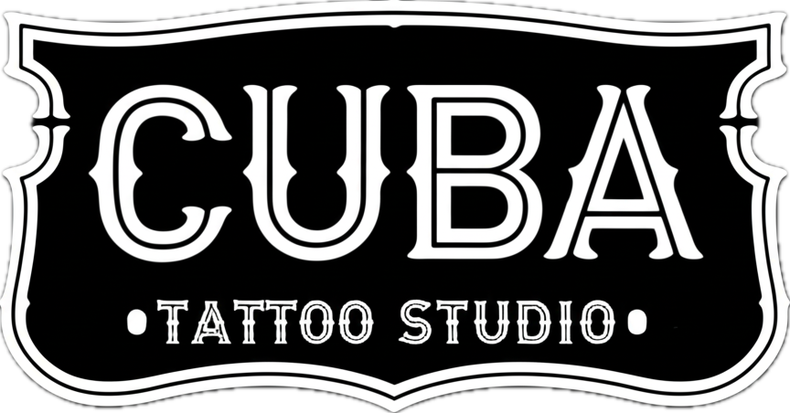

<link rel="stylesheet" href="assets/css/custom.css">

  
  <h1>Annexes & References</h1>
  
Additional resources, references, and supporting documentation.

  <nav class="docs-nav">
    <a href="index.html">Home</a>
    <a href="1-introduction_overview.html">Overview</a>
    <a href="2-architectural_strategic_fundamentals.html">Architecture</a>
    <a href="3-component_mapping_functional_overview.html">Components</a>
    <a href="4-ejecucion_agentes_flujos_operativos.html">Agents & Flows</a>
    <a href="5-roadmap_temporal_planning.html">Roadmap</a>
  </nav>

# Annexes and References

This document includes technical annexes, references, and additional resources relevant to the planning and execution of cubatattoostudio.com. It is intended for AI agents and technical teams to ensure comprehensive context and traceability.

## Technical Annexes
- Architectural diagrams and flowcharts
- API documentation and data models
- Security policies and compliance checklists
- UI/UX design guidelines and assets

## References
- [reactbits.dev](https://reactbits.dev) – Source for UI components
- [Next.js Documentation](https://nextjs.org/docs)
- [Tailwind CSS Documentation](https://tailwindcss.com/docs)
- [TypeScript Handbook](https://www.typescriptlang.org/docs/)
- [OWASP Security Guidelines](https://owasp.org/www-project-top-ten/)

## Additional Resources
- Project changelog and roadmap (see `docs/5-roadmap_temporal_planning.md`)
- Component mapping and implementation protocol (see `docs/2-feature_implementation_component_mapping.md`)
- Agent rules and workflow (see `.trae/project_rules.md`)

---
