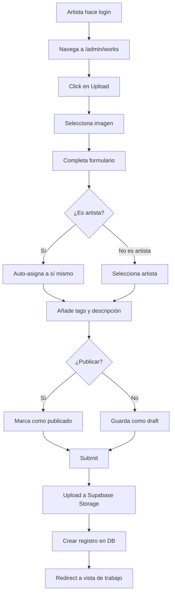
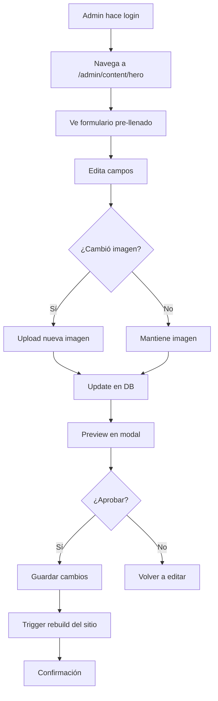

# Dashboard Administrativo

Documentación del dashboard administrativo planificado para Cuba Tattoo Studio.

## 📋 Tabla de Contenidos

- [Visión General](#visión-general)
- [Arquitectura](#arquitectura)
- [Funcionalidades](#funcionalidades)
- [Diseño de UI](#diseño-de-ui)
- [Flujos de Trabajo](#flujos-de-trabajo)
- [Implementación Técnica](#implementación-técnica)

## Visión General

El dashboard administrativo permitirá a admins y artistas gestionar todo el contenido del sitio de manera intuitiva sin necesidad de editar código directamente.

### Objetivos

- **Facilidad de uso**: Interfaz intuitiva para usuarios no técnicos
- **Seguridad**: Acceso basado en roles y permisos
- **Eficiencia**: Workflow optimizado para tareas comunes
- **Escalabilidad**: Diseño modular para añadir features futuras

### Usuarios del Dashboard

| Rol | Acceso | Permisos |
| :--- | :--- | :--- |
| **Admin** | Dashboard completo | CRUD total sobre todo el contenido |
| **Artista** | Dashboard limitado | CRUD solo de su propio portfolio |
| **Público** | Sin acceso | Solo visualización del sitio |

## Arquitectura

### Estructura de Rutas

```
/admin
├── /dashboard         # Overview y estadísticas
├── /artists          # Gestión de artistas
│   ├── /             # Lista de artistas
│   ├── /new          # Crear artista
│   └── /:id/edit     # Editar artista
├── /works            # Gestión de trabajos
│   ├── /             # Galería de trabajos
│   ├── /new          # Subir nuevo trabajo
│   └── /:id/edit     # Editar trabajo
├── /services         # Gestión de servicios
│   ├── /             # Lista de servicios
│   ├── /new          # Crear servicio
│   └── /:id/edit     # Editar servicio
├── /content          # Gestión de contenido
│   ├── /hero         # Editar sección Hero
│   ├── /about        # Editar sección About
│   └── /contact      # Editar información de contacto
├── /media            # Librería de medios
└── /settings         # Configuración del sitio
```

### Tech Stack del Dashboard

- **Framework**: Astro + React islands para componentes interactivos
- **UI Library**: Shadcn UI (componentes pre-construidos)
- **Forms**: React Hook Form con Zod validation
- **File Upload**: Dropzone o similar
- **Rich Text Editor**: TipTap o Lexical
- **Data Tables**: TanStack Table
- **Charts**: Recharts (para analytics)

## Funcionalidades

### 1. Dashboard Overview

**Propósito**: Vista general del estado del sitio

**Métricas mostradas:**
- Total de artistas activos
- Total de trabajos publicados
- Trabajos pendientes de revisión
- Visitas mensuales (si hay analytics)
- Últimas actividades

**Componentes:**
```
┌─────────────────────────────────────────┐
│  Dashboard - Cuba Tattoo Studio        │
├─────────────────────────────────────────┤
│                                         │
│  ┌────────┐ ┌────────┐ ┌────────┐     │
│  │   5    │ │  124   │ │   8    │     │
│  │Artists │ │ Works  │ │Pending │     │
│  └────────┘ └────────┘ └────────┘     │
│                                         │
│  Recent Activity                        │
│  ┌─────────────────────────────────┐   │
│  │ • David uploaded new work       │   │
│  │ • Nina updated profile          │   │
│  │ • Admin edited Hero section     │   │
│  └─────────────────────────────────┘   │
│                                         │
│  Quick Actions                          │
│  [+ New Work] [+ New Artist]           │
│                                         │
└─────────────────────────────────────────┘
```

### 2. Gestión de Artistas

**Funcionalidades:**
- Listar todos los artistas con filtros (activo/inactivo)
- Crear nuevo artista
- Editar perfil de artista
- Desactivar/activar artista
- Asignar usuario del sistema a artista
- Cambiar orden de visualización (drag & drop)

**Formulario de Artista:**

```typescript
interface ArtistForm {
    name: string;                 // Requerido
    slug: string;                 // Auto-generado, editable
    specialty: string;            // Requerido
    bio: string;                  // Textarea
    avatar: File | null;          // Upload de imagen
    portfolio_url?: string;       // URL externa (opcional)
    instagram?: string;           // Handle de Instagram
    display_order: number;        // Número de orden
    is_active: boolean;           // Toggle
    user_id?: string;             // Seleccionar usuario existente
}
```

**Vista de lista:**
```
┌──────────────────────────────────────────────────┐
│ Artists                          [+ New Artist]  │
├──────────────────────────────────────────────────┤
│ ┌──┬────────┬──────────────┬────────┬─────────┐ │
│ │☰│ Avatar │ Name         │ Active │ Actions │ │
│ ├──┼────────┼──────────────┼────────┼─────────┤ │
│ │☰│  [👤]  │ David Mesa   │   ✓    │ [✏️][👁] │ │
│ │☰│  [👤]  │ Nina Garcia  │   ✓    │ [✏️][👁] │ │
│ │☰│  [👤]  │ Karli Smith  │   ✓    │ [✏️][👁] │ │
│ └──┴────────┴──────────────┴────────┴─────────┘ │
└──────────────────────────────────────────────────┘
```

### 3. Gestión de Trabajos

**Funcionalidades:**
- Galería de todos los trabajos con thumbnails
- Filtros avanzados (artista, servicio, publicado, tags)
- Búsqueda por título/descripción
- Subida de imágenes con preview
- Edición masiva (publicar/despublicar múltiples)
- Marcar trabajos como destacados
- Sistema de tags

**Formulario de Trabajo:**

```typescript
interface WorkForm {
    title?: string;               // Opcional
    description?: string;         // Opcional, textarea
    image: File;                  // Requerido, upload
    artist_id: string;            // Select de artistas
    service_id?: string;          // Select de servicios
    tags: string[];               // Multi-select o input tags
    featured: boolean;            // Toggle
    published: boolean;           // Toggle
}
```

**Vista de galería:**
```
┌──────────────────────────────────────────────────┐
│ Works                               [+ Upload]   │
│ Filters: [Artist ▾] [Service ▾] [Status ▾]      │
├──────────────────────────────────────────────────┤
│                                                  │
│  ┌────────┐ ┌────────┐ ┌────────┐ ┌────────┐  │
│  │  [📷]  │ │  [📷]  │ │  [📷]  │ │  [📷]  │  │
│  │ David  │ │  Nina  │ │ Karli  │ │ David  │  │
│  │Realism │ │  Fine  │ │  Neo   │ │Portrait│  │
│  │   ⭐   │ │        │ │        │ │        │  │
│  └────────┘ └────────┘ └────────┘ └────────┘  │
│                                                  │
│  [Load More...]                                 │
│                                                  │
└──────────────────────────────────────────────────┘
```

### 4. Gestión de Servicios

**Funcionalidades:**
- Lista de servicios con reordenamiento
- Crear/editar/eliminar servicios
- Asignar imagen de portada
- Definir iconos (Lucide icons)
- Ver trabajos relacionados

**Formulario de Servicio:**

```typescript
interface ServiceForm {
    title: string;                // Requerido
    slug: string;                 // Auto-generado
    description: string;          // Textarea
    icon: string;                 // Selector de iconos Lucide
    cover_image: File | null;     // Upload opcional
    display_order: number;        // Orden
    is_active: boolean;           // Toggle
}
```

### 5. Gestión de Contenido del Sitio

**Secciones editables:**

**Hero Section:**
- Tagline principal
- Descripción secundaria
- Imagen de fondo (upload)
- CTA button text y link

**Contact Information:**
- Dirección del estudio
- Teléfono
- Email
- Horarios de atención
- Google Maps embed URL

**Formulario dinámico:**
```typescript
interface HeroContent {
    tagline: string;
    subtitle: string;
    background_image_url: string;
    cta_text: string;
    cta_link: string;
}

interface ContactInfo {
    address: string;
    phone: string;
    email: string;
    hours: {
        weekdays: string;
        weekend: string;
    };
    map_embed_url: string;
}
```

### 6. Librería de Medios

**Funcionalidades:**
- Vista de grid de todas las imágenes
- Upload drag & drop múltiple
- Organización por folders/categorías
- Búsqueda y filtros
- Metadata de imágenes (tamaño, dimensiones, fecha)
- Copiar URL pública
- Eliminar imágenes

**Optimización automática:**
- Resize a múltiples tamaños (thumbnail, medium, full)
- Conversión a WebP
- Compresión con calidad ajustable

### 7. Configuración del Sitio

**Opciones globales:**
- Nombre del sitio
- SEO metadata (title, description)
- Logo (upload)
- Favicon (upload)
- Social media links
- Google Analytics ID
- Modos de mantenimiento

## Diseño de UI

### Paleta de Colores

Consistente con el sitio principal (dark mode):

```css
:root {
    --bg-primary: #0a0a0a;
    --bg-secondary: #171717;
    --bg-tertiary: #262626;
    --text-primary: #fafafa;
    --text-secondary: #a3a3a3;
    --accent: #ffffff;
    --success: #22c55e;
    --warning: #eab308;
    --error: #ef4444;
}
```

### Layout Principal

```
┌────────────────────────────────────────────────┐
│ [Logo] Cuba Tattoo                   [Profile] │ ← Header
├────────┬───────────────────────────────────────┤
│        │                                       │
│ 📊 Dash│ Page Content Area                    │
│ 👥 Art │                                       │
│ 🖼️ Work│                                       │
│ ⚙️ Serv│                                       │
│ 📝 Cont│                                       │
│ 📁 Medi│                                       │
│ ⚙️ Sett│                                       │
│        │                                       │
│ ← Side │                                       │
│  bar   │                                       │
│        │                                       │
└────────┴───────────────────────────────────────┘
```

### Componentes Reutilizables

**Card Component:**
- Contenedor para secciones
- Variantes: default, outlined, elevated

**DataTable:**
- Sortable columns
- Pagination
- Row selection
- Search/Filter

**Form Components:**
- Input fields con validación
- File upload con preview
- Rich text editor
- Date pickers
- Toggle switches

## Flujos de Trabajo

### Workflow: Artista Sube Nuevo Trabajo



### Workflow: Admin Edita Contenido del Hero



## Implementación Técnica

### Stack Recomendado

```typescript
// Astro page con React islands
---
// src/pages/admin/dashboard.astro
import { supabase } from '../../lib/supabase';
import DashboardStats from '../../components/admin/DashboardStats';

const { data: stats } = await supabase.rpc('get_dashboard_stats');
---

<AdminLayout title="Dashboard">
    <DashboardStats client:load stats={stats} />
</AdminLayout>
```

### Componentes React

```typescript
// src/components/admin/WorkUpload.tsx
import { useForm } from 'react-hook-form';
import { zodResolver } from '@hookform/resolvers/zod';
import { z } from 'zod';

const workSchema = z.object({
    image: z.instanceof(File),
    artist_id: z.string().uuid(),
    title: z.string().optional(),
    description: z.string().optional(),
    tags: z.array(z.string()),
    published: z.boolean()
});

type WorkFormData = z.infer<typeof workSchema>;

export function WorkUpload() {
    const { register, handleSubmit, formState: { errors } } = useForm<WorkFormData>({
        resolver: zodResolver(workSchema)
    });

    const onSubmit = async (data: WorkFormData) => {
        // Upload logic
    };

    return (
        <form onSubmit={handleSubmit(onSubmit)}>
            {/* Form fields */}
        </form>
    );
}
```

### API Routes

```typescript
// src/pages/api/works/upload.ts
import type { APIRoute } from 'astro';
import { supabase } from '../../../lib/supabase';

export const POST: APIRoute = async ({ request }) => {
    const formData = await request.formData();
    const file = formData.get('image') as File;
    
    // Upload to Supabase Storage
    const fileName = `${Date.now()}-${file.name}`;
    const { data: uploadData, error: uploadError } = await supabase.storage
        .from('works')
        .upload(fileName, file);
    
    if (uploadError) {
        return new Response(JSON.stringify({ error: uploadError.message }), {
            status: 400
        });
    }
    
    // Get public URL
    const { data: { publicUrl } } = supabase.storage
        .from('works')
        .getPublicUrl(fileName);
    
    // Create DB record
    const { data, error } = await supabase
        .from('works')
        .insert({
            image_url: publicUrl,
            // ... other fields
        })
        .select()
        .single();
    
    return new Response(JSON.stringify({ success: true, data }), {
        status: 200
    });
};
```

### Deployment

**Build Trigger:**
- Webhook desde Supabase cuando se actualiza contenido
- Trigger manual desde dashboard
- CI/CD automático en commit

**Configuración de Webhook:**
```sql
-- Crear función de webhook
CREATE OR REPLACE FUNCTION trigger_rebuild()
RETURNS TRIGGER AS $$
BEGIN
    -- Llamar a webhook de Cloudflare Pages
    PERFORM http_post(
        'https://api.cloudflare.com/webhooks/deploy',
        '{"rebuild": true}'
    );
    RETURN NEW;
END;
$$ LANGUAGE plpgsql;

-- Trigger en updates importantes
CREATE TRIGGER rebuild_on_content_update
AFTER INSERT OR UPDATE ON site_content
FOR EACH ROW
EXECUTE FUNCTION trigger_rebuild();
```

---

**Última actualización**: 2025-11-23
