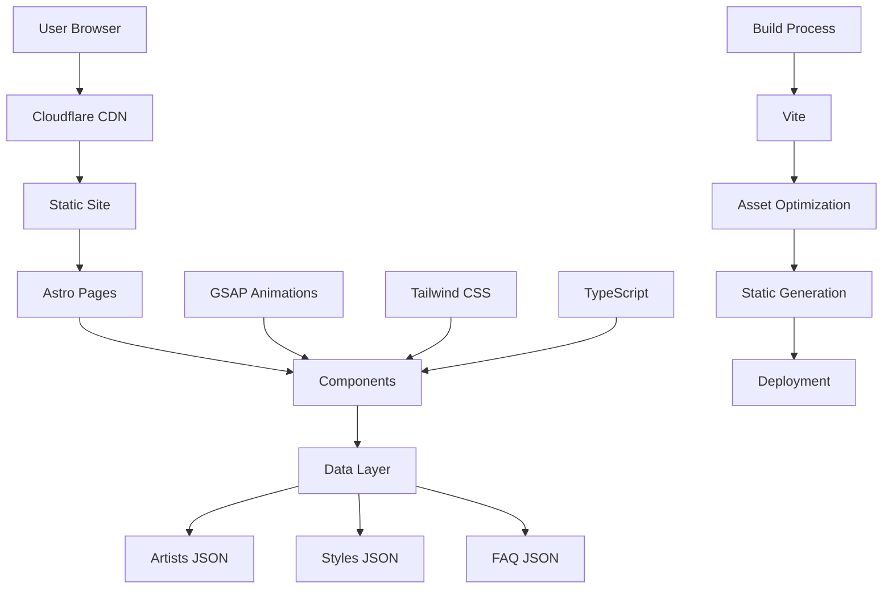

# Technical Architecture - Cuba Tattoo Studio

## 🏗️ System Overview

Cuba Tattoo Studio's website is built using a modern, performance-first architecture that prioritizes user experience, developer productivity, and maintainability. The system leverages static site generation with selective hydration to deliver exceptional performance while maintaining rich interactivity.

## 🎯 Architecture Principles

### Core Principles
1. **Performance First** - Optimized for Core Web Vitals and user experience
2. **Progressive Enhancement** - Works without JavaScript, enhanced with it
3. **Component-Driven** - Reusable, maintainable UI components
4. **Type Safety** - Full TypeScript implementation
5. **Accessibility** - WCAG 2.1 AA compliance by design
6. **SEO Optimized** - Built-in search engine optimization

### Design Patterns
- **Islands Architecture** - Selective hydration for optimal performance
- **Utility-First CSS** - Tailwind CSS for rapid development
- **Component Composition** - Flexible, reusable component system
- **Data-Driven Content** - JSON-based content management
- **Progressive Web App** - Enhanced mobile experience

## 🛠️ Technology Stack

### Frontend Framework

#### Astro 5.x
```javascript
// astro.config.mjs
export default defineConfig({
  site: 'https://cubatattoostudio.com',
  integrations: [
    sitemap(),
    compress({
      CSS: true,
      HTML: true,
      Image: { quality: 85, format: 'webp' },
      JavaScript: true,
      SVG: true
    })
  ],
  build: {
    inlineStylesheets: 'auto',
    assets: 'assets'
  }
});
```

**Key Features:**
- **Static Site Generation** - Pre-rendered HTML for optimal performance
- **Islands Architecture** - Selective hydration for interactive components
- **Built-in Optimizations** - Image optimization, CSS/JS minification
- **TypeScript Support** - Full type safety out of the box

#### Tailwind CSS 4.x
```javascript
// tailwind.config.js
export default {
  content: ['./src/**/*.{astro,html,js,jsx,md,mdx,svelte,ts,tsx,vue}'],
  theme: {
    extend: {
      colors: {
        'cuba-black': '#000000',
        'cuba-white': '#FFFFFF',
        'cuba-gray': {
          400: '#A0A0A0',
          600: '#525252'
        }
      },
      fontFamily: {
        'heading': ['Bebas Neue', 'Arial Black', 'sans-serif'],
        'body': ['Inter', 'system-ui', 'sans-serif']
      }
    }
  }
};
```

**Benefits:**
- **Utility-First** - Rapid development with consistent design
- **Custom Design System** - Brand-specific color and typography scales
- **Responsive Design** - Mobile-first breakpoint system
- **Performance** - Purged CSS for minimal bundle size

#### GSAP 3.x (GreenSock)
```javascript
// Animation implementation
import { gsap } from 'gsap';
import { ScrollTrigger } from 'gsap/ScrollTrigger';

gsap.registerPlugin(ScrollTrigger);

// Cinematic homepage animations
const tl = gsap.timeline();
tl.from('.hero-logo', { opacity: 0, scale: 0.8, duration: 1.5 })
  .from('.hero-text', { y: 50, opacity: 0, stagger: 0.2 }, '-=0.5');
```

**Animation Features:**
- **Cinematic Sequences** - Inspired by Rockstar Games
- **Scroll Triggers** - Animations tied to scroll position
- **Performance Optimized** - Hardware-accelerated transforms
- **Progressive Enhancement** - Graceful degradation

## 🏛️ System Architecture

### High-Level Architecture



### Component Architecture

```
src/components/
├── animations/          # GSAP animation wrappers
│   ├── FadeInSection.astro
│   ├── ParallaxContainer.astro
│   ├── SlideInImage.astro
│   └── StaggerText.astro
├── effects/             # Visual effects
│   └── ParticleSystem.astro
├── forms/               # Form components
│   └── BookingForm.astro
├── gallery/             # Portfolio components
│   ├── PortfolioFilters.astro
│   └── PortfolioGrid.astro
├── layout/              # Layout components
│   ├── Header.astro
│   └── Footer.astro
└── ui/                  # Basic UI components
    ├── Button.astro
    ├── Card.astro
    ├── Input.astro
    └── Badge.astro
```

## 📊 Data Architecture

### Content Management Strategy

#### JSON-Based Content
```json
// src/data/artists.json
{
  "artists": [
    {
      "id": "david",
      "name": "David",
      "slug": "david",
      "specialties": ["Japanese", "Blackwork", "Traditional"],
      "bio": "Artist biography...",
      "experience": "8+ years",
      "image": "/images/artists/david.jpg",
      "featured": true,
      "portfolio": [
        {
          "id": "david-1",
          "image": "/images/portfolio/david-dragon.jpg",
          "title": "Japanese Dragon",
          "style": "Japanese",
          "description": "Traditional Japanese dragon full arm sleeve",
          "size": "large",
          "bodyPart": "arm"
        }
      ]
    }
  ]
}
```

#### Data Flow
1. **Static Data** - JSON files imported at build time
2. **Type Generation** - TypeScript interfaces for data structures
3. **Build-Time Processing** - Data transformation and optimization
4. **Static Generation** - Pre-rendered pages with data

### Content Types

#### Artists
- **Profile Information** - Name, bio, experience, specialties
- **Portfolio Items** - Images, descriptions, categorization
- **Contact Details** - Booking preferences, social links

#### Tattoo Styles
- **Style Definitions** - Name, description, characteristics
- **Artist Associations** - Which artists specialize in each style
- **Portfolio Filtering** - Category-based filtering system

#### Studio Information
- **Business Details** - Hours, location, contact information
- **FAQ Content** - Common questions and answers
- **Process Information** - Booking, consultation, aftercare

## 🎨 Component System

### Design System Components

#### Base Components
```astro
<!-- Button.astro -->
---
export interface Props {
  variant?: 'primary' | 'secondary' | 'outline';
  size?: 'sm' | 'md' | 'lg';
  href?: string;
  type?: 'button' | 'submit' | 'reset';
}

const { 
  variant = 'primary', 
  size = 'md', 
  href, 
  type = 'button' 
} = Astro.props;

const baseClasses = 'font-heading uppercase tracking-wider transition-all duration-300';
const variantClasses = {
  primary: 'bg-cuba-white text-cuba-black hover:bg-cuba-gray-400',
  secondary: 'bg-transparent text-cuba-white border border-cuba-white hover:bg-cuba-white hover:text-cuba-black',
  outline: 'bg-transparent text-cuba-white border border-cuba-gray-600 hover:border-cuba-white'
};
const sizeClasses = {
  sm: 'px-4 py-2 text-sm',
  md: 'px-6 py-3 text-base',
  lg: 'px-8 py-4 text-lg'
};
---

{href ? (
  <a href={href} class={`${baseClasses} ${variantClasses[variant]} ${sizeClasses[size]}`}>
    <slot />
  </a>
) : (
  <button type={type} class={`${baseClasses} ${variantClasses[variant]} ${sizeClasses[size]}`}>
    <slot />
  </button>
)}
```

#### Animation Components
```astro
<!-- FadeInSection.astro -->
---
export interface Props {
  delay?: number;
  duration?: number;
  intensity?: 'low' | 'medium' | 'high';
  class?: string;
}

const { 
  delay = 0, 
  duration = 1, 
  intensity = 'medium',
  class: className = ''
} = Astro.props;
---

<div 
  class={`fade-in-section ${className}`} 
  data-delay={delay}
  data-duration={duration}
  data-intensity={intensity}
>
  <slot />
</div>

<script>
  import { gsap } from 'gsap';
  import { ScrollTrigger } from 'gsap/ScrollTrigger';
  
  gsap.registerPlugin(ScrollTrigger);
  
  document.querySelectorAll('.fade-in-section').forEach((element) => {
    const delay = parseFloat(element.dataset.delay || '0');
    const duration = parseFloat(element.dataset.duration || '1');
    const intensity = element.dataset.intensity || 'medium';
    
    const yOffset = {
      low: 20,
      medium: 50,
      high: 100
    }[intensity];
    
    gsap.fromTo(element, 
      { 
        opacity: 0, 
        y: yOffset 
      },
      {
        opacity: 1,
        y: 0,
        duration,
        delay,
        scrollTrigger: {
          trigger: element,
          start: 'top 80%',
          toggleActions: 'play none none reverse'
        }
      }
    );
  });
</script>
```

## 🚀 Performance Architecture

### Optimization Strategies

#### Image Optimization
```javascript
// Astro's built-in image optimization
import { Image } from 'astro:assets';

// Automatic WebP/AVIF conversion
// Responsive image generation
// Lazy loading by default
// Proper sizing and compression
```

#### Code Splitting
```javascript
// vite.config.js
export default {
  build: {
    rollupOptions: {
      output: {
        manualChunks: {
          gsap: ['gsap'],
          vendor: ['astro']
        }
      }
    }
  }
};
```

#### Asset Optimization
- **CSS Purging** - Remove unused Tailwind classes
- **JavaScript Minification** - Terser optimization
- **Image Compression** - Sharp-based processing
- **SVG Optimization** - SVGO integration

### Performance Monitoring

#### Core Web Vitals Tracking
```javascript
// Performance monitoring
function measureCoreWebVitals() {
  // Largest Contentful Paint
  new PerformanceObserver((list) => {
    const entries = list.getEntries();
    const lastEntry = entries[entries.length - 1];
    console.log('LCP:', lastEntry.startTime);
  }).observe({ entryTypes: ['largest-contentful-paint'] });
  
  // First Input Delay
  new PerformanceObserver((list) => {
    const entries = list.getEntries();
    entries.forEach((entry) => {
      console.log('FID:', entry.processingStart - entry.startTime);
    });
  }).observe({ entryTypes: ['first-input'] });
  
  // Cumulative Layout Shift
  new PerformanceObserver((list) => {
    let clsScore = 0;
    const entries = list.getEntries();
    entries.forEach((entry) => {
      if (!entry.hadRecentInput) {
        clsScore += entry.value;
      }
    });
    console.log('CLS:', clsScore);
  }).observe({ entryTypes: ['layout-shift'] });
}
```

## 🔒 Security Architecture

### Security Measures

#### Content Security Policy
```html
<!-- CSP Headers -->
<meta http-equiv="Content-Security-Policy" 
      content="default-src 'self'; 
               script-src 'self' 'unsafe-inline' https://www.googletagmanager.com;
               style-src 'self' 'unsafe-inline' https://fonts.googleapis.com;
               img-src 'self' data: https:;
               font-src 'self' https://fonts.gstatic.com;">
```

#### Form Security
- **Input Validation** - Client and server-side validation
- **CSRF Protection** - Token-based form protection
- **Rate Limiting** - Prevent form spam and abuse
- **Sanitization** - Clean user input before processing

#### Privacy & Compliance
- **GDPR Compliance** - Cookie consent and data handling
- **Analytics Privacy** - Anonymized user tracking
- **Data Minimization** - Collect only necessary information

## 📱 Mobile Architecture

### Responsive Design Strategy

#### Breakpoint System
```css
/* Tailwind CSS Breakpoints */
/* sm: 640px */
/* md: 768px */
/* lg: 1024px */
/* xl: 1280px */
/* 2xl: 1536px */

/* Mobile-first approach */
.hero-title {
  @apply text-4xl;
  @apply sm:text-5xl;
  @apply md:text-6xl;
  @apply lg:text-7xl;
}
```

#### Touch Interactions
- **Touch-Friendly Targets** - Minimum 44px touch targets
- **Gesture Support** - Swipe navigation for galleries
- **Haptic Feedback** - Enhanced mobile interactions
- **Viewport Optimization** - Proper mobile viewport settings

### Progressive Web App Features
- **Service Worker** - Offline functionality
- **Web App Manifest** - Install prompt and app-like experience
- **Push Notifications** - Appointment reminders
- **Background Sync** - Offline form submissions

## 🔧 Development Architecture

### Development Environment

#### DevContainer Setup
```json
// .devcontainer/devcontainer.json
{
  "name": "Cuba Tattoo Studio Dev",
  "dockerComposeFile": "docker-compose.yml",
  "service": "app",
  "workspaceFolder": "/workspace",
  "features": {
    "ghcr.io/devcontainers/features/node:1": {
      "version": "20"
    }
  },
  "customizations": {
    "vscode": {
      "extensions": [
        "astro-build.astro-vscode",
        "bradlc.vscode-tailwindcss",
        "esbenp.prettier-vscode"
      ]
    }
  },
  "postCreateCommand": "pnpm install",
  "postStartCommand": "pnpm dev"
}
```

#### Build Pipeline
```yaml
# .github/workflows/deploy.yml
name: Deploy to Cloudflare Pages

on:
  push:
    branches: [main]

jobs:
  deploy:
    runs-on: ubuntu-latest
    steps:
      - uses: actions/checkout@v4
      - uses: pnpm/action-setup@v2
        with:
          version: 8
      - uses: actions/setup-node@v4
        with:
          node-version: 20
          cache: 'pnpm'
      - run: pnpm install
      - run: pnpm build
      - uses: cloudflare/pages-action@v1
        with:
          apiToken: ${{ secrets.CLOUDFLARE_API_TOKEN }}
          accountId: ${{ secrets.CLOUDFLARE_ACCOUNT_ID }}
          projectName: cuba-tattoo-studio
          directory: dist
```

### Quality Assurance

#### Type Safety
```typescript
// src/types/index.ts
export interface Artist {
  id: string;
  name: string;
  slug: string;
  specialties: TattooStyle[];
  bio: string;
  experience: string;
  image: string;
  featured: boolean;
  portfolio: PortfolioItem[];
}

export interface PortfolioItem {
  id: string;
  image: string;
  title: string;
  style: TattooStyle;
  description: string;
  size: 'small' | 'medium' | 'large';
  bodyPart: string;
}

export type TattooStyle = 
  | 'Japanese'
  | 'Blackwork'
  | 'Traditional'
  | 'Realism'
  | 'Geometric'
  | 'Minimalist';
```

#### Testing Strategy
- **Type Checking** - TypeScript compilation
- **Build Testing** - Successful build verification
- **Lighthouse Audits** - Performance and accessibility testing
- **Manual Testing** - Cross-browser and device testing

---

*This technical architecture document serves as the blueprint for the Cuba Tattoo Studio website's implementation. It should be referenced for all technical decisions and maintained as the system evolves.*