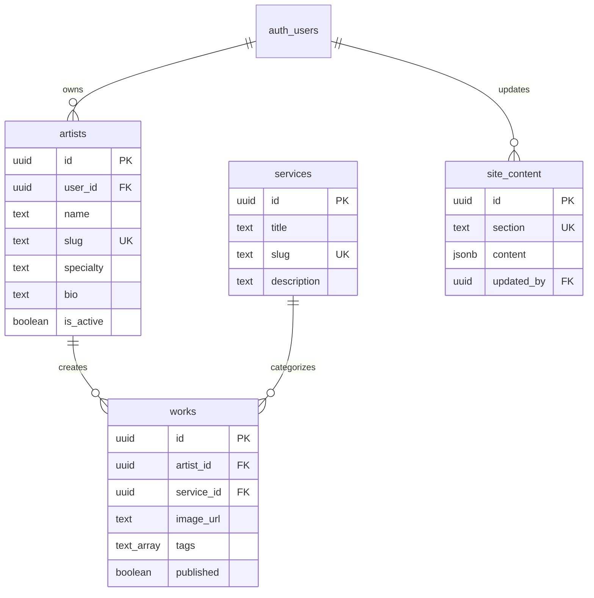

# Integración con Supabase

Esta guía documenta la integración de Supabase como Backend as a Service (BaaS) para Cuba Tattoo Studio.

## 📋 Tabla de Contenidos

- [Visión General](#visión-general)
- [Configuración Inicial](#configuración-inicial)
- [Esquema de Base de Datos](#esquema-de-base-de-datos)
- [Row Level Security](#row-level-security)
- [Storage Configuration](#storage-configuration)
- [Cliente de Supabase](#cliente-de-supabase)
- [Migraciones](#migraciones)
- [Consultas Comunes](#consultas-comunes)

## Visión General

Supabase proporciona:
- **PostgreSQL Database**: Base de datos relacional escalable
- **Authentication**: Sistema de autenticación con múltiples providers
- **Storage**: Gestión de archivos e imágenes
- **Row Level Security**: Seguridad a nivel de fila
- **Real-time**: Subscripciones en tiempo real (opcional)
- **Edge Functions**: Funciones serverless

## Configuración Inicial

### 1. Crear Proyecto en Supabase

1. Ir a [supabase.com](https://supabase.com)
2. Crear una nueva organización (si no existe)
3. Crear nuevo proyecto:
   - **Nombre**: Cuba Tattoo Studio
   - **Database Password**: Guardar en lugar seguro
   - **Región**: Elegir más cercana (US West, US East, etc.)

### 2. Variables de Entorno

Crear archivo `.env` en la raíz del proyecto:

```bash
# Supabase Configuration
PUBLIC_SUPABASE_URL=https://your-project-id.supabase.co
PUBLIC_SUPABASE_ANON_KEY=your-anon-key
SUPABASE_SERVICE_ROLE_KEY=your-service-role-key
```

> **⚠️ Importante**: Agregar `.env` al `.gitignore` para no exponer las keys

Actualizar `.env.example`:

```bash
# Supabase Configuration
PUBLIC_SUPABASE_URL=
PUBLIC_SUPABASE_ANON_KEY=
SUPABASE_SERVICE_ROLE_KEY=
```

### 3. Instalar Dependencias

```bash
npm install @supabase/supabase-js
npm install -D @supabase/auth-helpers-astro
```

### 4. Configurar TypeScript

Crear archivo de tipos `src/types/supabase.ts`:

```typescript
export type Json =
  | string
  | number
  | boolean
  | null
  | { [key: string]: Json | undefined }
  | Json[]

export interface Database {
  public: {
    Tables: {
      artists: {
        Row: {
          id: string
          user_id: string | null
          name: string
          slug: string
          specialty: string
          bio: string | null
          avatar_url: string | null
          portfolio_url: string | null
          instagram: string | null
          display_order: number
          is_active: boolean
          created_at: string
          updated_at: string
        }
        Insert: {
          id?: string
          user_id?: string | null
          name: string
          slug: string
          specialty: string
          bio?: string | null
          avatar_url?: string | null
          portfolio_url?: string | null
          instagram?: string | null
          display_order?: number
          is_active?: boolean
          created_at?: string
          updated_at?: string
        }
        Update: {
          id?: string
          user_id?: string | null
          name?: string
          slug?: string
          specialty?: string
          bio?: string | null
          avatar_url?: string | null
          portfolio_url?: string | null
          instagram?: string | null
          display_order?: number
          is_active?: boolean
          created_at?: string
          updated_at?: string
        }
      }
      // ... otras tablas
    }
  }
}
```

## Esquema de Base de Datos

### SQL de Creación de Tablas

Ejecutar en el SQL Editor de Supabase:

```sql
-- Habilitar extensión UUID
CREATE EXTENSION IF NOT EXISTS "uuid-ossp";

-- Tabla de artistas
CREATE TABLE artists (
    id UUID PRIMARY KEY DEFAULT uuid_generate_v4(),
    user_id UUID REFERENCES auth.users(id) ON DELETE SET NULL,
    name TEXT NOT NULL,
    slug TEXT UNIQUE NOT NULL,
    specialty TEXT NOT NULL,
    bio TEXT,
    avatar_url TEXT,
    portfolio_url TEXT,
    instagram TEXT,
    display_order INTEGER DEFAULT 0,
    is_active BOOLEAN DEFAULT true,
    created_at TIMESTAMPTZ DEFAULT NOW(),
    updated_at TIMESTAMPTZ DEFAULT NOW()
);

-- Tabla de servicios
CREATE TABLE services (
    id UUID PRIMARY KEY DEFAULT uuid_generate_v4(),
    title TEXT NOT NULL,
    slug TEXT UNIQUE NOT NULL,
    description TEXT,
    icon TEXT,
    cover_image_url TEXT,
    display_order INTEGER DEFAULT 0,
    is_active BOOLEAN DEFAULT true,
    created_at TIMESTAMPTZ DEFAULT NOW(),
    updated_at TIMESTAMPTZ DEFAULT NOW()
);

-- Tabla de trabajos/tatuajes
CREATE TABLE works (
    id UUID PRIMARY KEY DEFAULT uuid_generate_v4(),
    artist_id UUID REFERENCES artists(id) ON DELETE CASCADE,
    service_id UUID REFERENCES services(id) ON DELETE SET NULL,
    title TEXT,
    description TEXT,
    image_url TEXT NOT NULL,
    tags TEXT[],
    featured BOOLEAN DEFAULT false,
    published BOOLEAN DEFAULT false,
    created_at TIMESTAMPTZ DEFAULT NOW(),
    updated_at TIMESTAMPTZ DEFAULT NOW()
);

-- Tabla de contenido del sitio
CREATE TABLE site_content (
    id UUID PRIMARY KEY DEFAULT uuid_generate_v4(),
    section TEXT UNIQUE NOT NULL,
    content JSONB NOT NULL,
    updated_at TIMESTAMPTZ DEFAULT NOW(),
    updated_by UUID REFERENCES auth.users(id)
);

-- Tabla de configuración
CREATE TABLE site_config (
    key TEXT PRIMARY KEY,
    value JSONB NOT NULL,
    updated_at TIMESTAMPTZ DEFAULT NOW()
);

-- Índices para optimizar consultas
CREATE INDEX idx_artists_active ON artists(is_active) WHERE is_active = true;
CREATE INDEX idx_artists_display_order ON artists(display_order);
CREATE INDEX idx_works_artist ON works(artist_id);
CREATE INDEX idx_works_published ON works(published) WHERE published = true;
CREATE INDEX idx_works_tags ON works USING GIN(tags);

-- Función para actualizar updated_at automáticamente
CREATE OR REPLACE FUNCTION update_updated_at_column()
RETURNS TRIGGER AS $$
BEGIN
    NEW.updated_at = NOW();
    RETURN NEW;
END;
$$ language 'plpgsql';

-- Triggers para updated_at
CREATE TRIGGER update_artists_updated_at BEFORE UPDATE ON artists
    FOR EACH ROW EXECUTE FUNCTION update_updated_at_column();

CREATE TRIGGER update_services_updated_at BEFORE UPDATE ON services
    FOR EACH ROW EXECUTE FUNCTION update_updated_at_column();

CREATE TRIGGER update_works_updated_at BEFORE UPDATE ON works
    FOR EACH ROW EXECUTE FUNCTION update_updated_at_column();
```

### Diagrama de Relaciones



## Row Level Security

### Habilitar RLS

```sql
ALTER TABLE artists ENABLE ROW LEVEL SECURITY;
ALTER TABLE services ENABLE ROW LEVEL SECURITY;
ALTER TABLE works ENABLE ROW LEVEL SECURITY;
ALTER TABLE site_content ENABLE ROW LEVEL SECURITY;
ALTER TABLE site_config ENABLE ROW LEVEL SECURITY;
```

### Políticas de Seguridad

```sql
-- ==================== ARTISTS ====================
-- Lectura pública de artistas activos
CREATE POLICY "Artistas activos visibles públicamente"
    ON artists FOR SELECT
    TO public
    USING (is_active = true);

-- Artistas pueden ver su propio perfil aunque esté inactivo
CREATE POLICY "Artistas pueden ver su propio perfil"
    ON artists FOR SELECT
    TO authenticated
    USING (auth.uid() = user_id);

-- Artistas pueden actualizar su propio perfil
CREATE POLICY "Artistas pueden actualizar su perfil"
    ON artists FOR UPDATE
    TO authenticated
    USING (auth.uid() = user_id)
    WITH CHECK (auth.uid() = user_id);

-- Solo admins pueden crear/eliminar artistas
CREATE POLICY "Solo admins pueden crear artistas"
    ON artists FOR INSERT
    TO authenticated
    WITH CHECK (auth.jwt() ->> 'role' = 'admin');

CREATE POLICY "Solo admins pueden eliminar artistas"
    ON artists FOR DELETE
    TO authenticated
    USING (auth.jwt() ->> 'role' = 'admin');

-- ==================== WORKS ====================
-- Lectura pública de trabajos publicados
CREATE POLICY "Trabajos publicados visibles públicamente"
    ON works FOR SELECT
    TO public
    USING (published = true);

-- Artistas pueden ver todos sus trabajos
CREATE POLICY "Artistas pueden ver sus trabajos"
    ON works FOR SELECT
    TO authenticated
    USING (
        artist_id IN (
            SELECT id FROM artists WHERE user_id = auth.uid()
        )
    );

-- Artistas y admins pueden crear trabajos
CREATE POLICY "Artistas pueden crear trabajos"
    ON works FOR INSERT
    TO authenticated
    WITH CHECK (
        artist_id IN (
            SELECT id FROM artists WHERE user_id = auth.uid()
        ) OR auth.jwt() ->> 'role' = 'admin'
    );

-- Artistas pueden actualizar sus trabajos, admins todos
CREATE POLICY "Artistas pueden actualizar sus trabajos"
    ON works FOR UPDATE
    TO authenticated
    USING (
        artist_id IN (
            SELECT id FROM artists WHERE user_id = auth.uid()
        ) OR auth.jwt() ->> 'role' = 'admin'
    );

-- Solo artistas propietarios y admins pueden eliminar
CREATE POLICY "Artistas pueden eliminar sus trabajos"
    ON works FOR DELETE
    TO authenticated
    USING (
        artist_id IN (
            SELECT id FROM artists WHERE user_id = auth.uid()
        ) OR auth.jwt() ->> 'role' = 'admin'
    );

-- ==================== SERVICES ====================
-- Lectura pública de servicios activos
CREATE POLICY "Servicios activos visibles públicamente"
    ON services FOR SELECT
    TO public
    USING (is_active = true);

-- Solo admins pueden gestionar servicios
CREATE POLICY "Solo admins pueden gestionar servicios"
    ON services FOR ALL
    TO authenticated
    USING (auth.jwt() ->> 'role' = 'admin')
    WITH CHECK (auth.jwt() ->> 'role' = 'admin');

-- ==================== SITE CONTENT ====================
-- Lectura pública del contenido
CREATE POLICY "Contenido visible públicamente"
    ON site_content FOR SELECT
    TO public
    USING (true);

-- Solo admins pueden editar contenido
CREATE POLICY "Solo admins pueden editar contenido"
    ON site_content FOR ALL
    TO authenticated
    USING (auth.jwt() ->> 'role' = 'admin')
    WITH CHECK (auth.jwt() ->> 'role' = 'admin');
```

## Storage Configuration

### Crear Buckets

```sql
-- Crear buckets en Supabase Dashboard > Storage
-- O usar el SQL:
INSERT INTO storage.buckets (id, name, public)
VALUES 
    ('avatars', 'avatars', true),
    ('works', 'works', true),
    ('site-assets', 'site-assets', true);
```

### Políticas de Storage

```sql
-- Bucket: avatars
-- Lectura pública
CREATE POLICY "Avatares públicos"
    ON storage.objects FOR SELECT
    TO public
    USING (bucket_id = 'avatars');

-- Subida solo para authenticated users
CREATE POLICY "Usuarios autenticados pueden subir avatares"
    ON storage.objects FOR INSERT
    TO authenticated
    WITH CHECK (bucket_id = 'avatars');

-- Bucket: works
-- Lectura pública
CREATE POLICY "Trabajos públicos"
    ON storage.objects FOR SELECT
    TO public
    USING (bucket_id = 'works');

-- Subida para artistas y admins
CREATE POLICY "Artistas pueden subir trabajos"
    ON storage.objects FOR INSERT
    TO authenticated
    WITH CHECK (
        bucket_id = 'works' AND (
            auth.uid() IN (SELECT user_id FROM artists) OR
            auth.jwt() ->> 'role' = 'admin'
        )
    );
```

## Cliente de Supabase

### Configuración del Cliente

Crear `src/lib/supabase.ts`:

```typescript
import { createClient } from '@supabase/supabase-js';
import type { Database } from '../types/supabase';

const supabaseUrl = import.meta.env.PUBLIC_SUPABASE_URL;
const supabaseAnonKey = import.meta.env.PUBLIC_SUPABASE_ANON_KEY;

if (!supabaseUrl || !supabaseAnonKey) {
    throw new Error('Missing Supabase environment variables');
}

export const supabase = createClient<Database>(supabaseUrl, supabaseAnonKey, {
    auth: {
        persistSession: true,
        autoRefreshToken: true,
    },
});
```

### Uso en Componentes Astro

```astro
---
// src/components/Artists.astro
import { supabase } from '../lib/supabase';

const { data: artists, error } = await supabase
    .from('artists')
    .select('*')
    .eq('is_active', true)
    .order('display_order');

if (error) {
    console.error('Error fetching artists:', error);
}
---

<section id="artists">
    {artists?.map(artist => (
        <div class="artist-card">
            
            <h3>{artist.name}</h3>
            <p>{artist.specialty}</p>
        </div>
    ))}
</section>
```

## Migraciones

### Sistema de Migraciones

Usar Supabase CLI para gestionar migraciones:

```bash
# Instalar Supabase CLI
npm install -g supabase

# Inicializar Supabase en el proyecto
supabase init

# Crear nueva migración
supabase migration new create_artists_table

# Aplicar migraciones
supabase db push
```

### Estructura de Migraciones

```
/supabase
  /migrations
    20231201000000_initial_schema.sql
    20231205000000_add_rls_policies.sql
    20231210000000_add_indexes.sql
```

## Consultas Comunes

### Fetch de Artistas Activos

```typescript
const { data: artists } = await supabase
    .from('artists')
    .select('*')
    .eq('is_active', true)
    .order('display_order');
```

### Fetch de Trabajos con Artista

```typescript
const { data: works } = await supabase
    .from('works')
    .select(`
        *,
        artist:artists(name, slug),
        service:services(title)
    `)
    .eq('published', true)
    .order('created_at', { ascending: false });
```

### Búsqueda por Tags

```typescript
const { data: works } = await supabase
    .from('works')
    .select('*')
    .contains('tags', ['realism', 'portrait']);
```

### Upload de Imagen

```typescript
const uploadImage = async (file: File, bucket: string) => {
    const fileName = `${Date.now()}-${file.name}`;
    
    const { data, error } = await supabase.storage
        .from(bucket)
        .upload(fileName, file, {
            cacheControl: '3600',
            upsert: false
        });
    
    if (error) throw error;
    
    // Get public URL
    const { data: { publicUrl } } = supabase.storage
        .from(bucket)
        .getPublicUrl(fileName);
    
    return publicUrl;
};
```

---

**Última actualización**: 2025-11-23

## Actualizaciones: Perfiles, RLS y Seeds

- Perfiles y roles:
  - Añadir tabla `profiles` con `role` en `'admin' | 'artist' | 'viewer'`.
  - Políticas RLS usan `EXISTS` sobre `profiles` para permisos de admin.
- Migraciones:
  - Ejecutar `supabase/migrations/003_profiles_and_rls.sql` para crear `profiles` y restablecer políticas robustas.
- Seeds:
  - `npm run seed-users` crea el usuario admin y su perfil.
  - `npm run seed-db` migra artistas, servicios y works desde `src/content`.
- Pruebas:
  - `npm test` ejecuta Vitest. Instalar `vitest` si falta.
